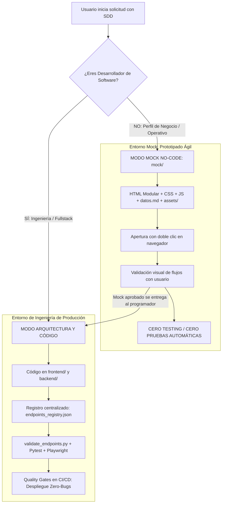

# Metodología SDD — Spec-Driven Development
## Ecosistema Corporativo Greenyard / Jolifoods
### Estándar Oficial de Ingeniería, Prototipado No-Code y Aseguramiento de Calidad

Repositorio oficial y estándar de ingeniería de software guiado por especificaciones (**Spec-Driven Development - SDD**). Diseñado para ser agnóstico, modular y 100% portable tanto para desarrolladores e ingenieros de software como para personas no técnicas (líderes de área, analistas de negocio) y agentes autónomos de Inteligencia Artificial.

---

## 🎯 1. ¿Qué es SDD?

**Spec-Driven Development (SDD)** es un marco de trabajo de ingeniería integral donde los requerimientos, contratos de datos, prototipos interactivos, lineamientos de seguridad, observabilidad, pruebas automatizadas y despliegue se definen formalmente de manera previa a la implementación en código fuente.

Permite a las organizaciones:
1. **Separar la concepción de la implementación**: Los usuarios no técnicos validan prototipos interactivos antes de escribir backend o frontend.
2. **Erradicar el retrabajo y la ambigüedad**: Especificaciones atómicas con contratos TypeScript y esquemas Pydantic/Django.
3. **Garantizar calidad Cero-Bugs**: Validación previa de endpoints, Quality Gates en CI/CD y trazabilidad extremo a extremo.
4. **Fomentar la mejora continua**: Medición de adopción in-app, encuestas a usuarios y evolución guiada por datos.

---

## 📂 2. Nueva Jerarquía y Estructura del Ecosistema

```text
.sdd/
├── assets/                                  # Identidad corporativa, logos SVG y recursos visuales oficiales
│   ├── Jolifoods.svg                        # Logotipo completo vectorizado
│   ├── Joli.svg                             # Isotipo oficial vectorizado
│   └── logoJoli.png                         # Logotipo de respaldo en mapa de bits
│
├── components/                              # Catálogo de 35 suites UI/UX desacopladas y reutilizables
│   ├── badge/                               # Badges semánticos de estado y rol
│   ├── biometrics/                          # Escáner biométrico facial WebRTC con máscara oval (contenedores)
│   ├── button/                              # Icon action groups (28px toolbar, 26px fila agrupada)
│   ├── calendar/                            # Calendario mensual corporativo de turnos (vibra)
│   ├── card/                                # [NUEVO] CorporateCard (Header, Body, Footer desacoplados)
│   ├── charts/                              # Gráficas estándar y [NUEVO] Advanced Analytics (Gantt, Radar, Gauge, Sankey)
│   ├── context/                             # AuthContext, RBAC y sincronización de tema Noche/Día
│   ├── dashboard/                           # [NUEVO] PlatformUsageDashboard (telemetría de uso y encuestas in-app)
│   ├── data_table/                          # Tabla tipo Excel con ChecklistPopover, ColumnResizer y ColumnVisibility
│   ├── drawer/                              # Right Sidebar Drawer para CRUDs y detalles (prohibido modales para formularios)
│   ├── dropdown/                            # SelectFilter con búsqueda integrada y filtros de cabecera
│   ├── empty_state/                         # Estados vacíos ilustrados con llamadas a la acción
│   ├── error_boundary/                      # Resiliencia ante caídas y auto-recarga ante ChunkLoadError
│   ├── export/                              # Exportación a Excel (.xlsx) con auto-anchos
│   ├── kpi/                                 # Tarjetas KPI BI Cartera con halo cromático y filtro cruzado
│   ├── layout/                              # TopNavbar, UserProfileDropdown y Reglas 100% Horizontal
│   ├── loader/                              # PageLoader con isotipo Jolifoods y Skeletons shimmer
│   ├── login/                               # Suite de autenticación, Microsoft SSO M365, recovery y logos
│   ├── modal/                               # ConfirmModal, ModalDialog y [NUEVO] ProModal (Seguridad OTP, Wizard, Split)
│   ├── notification/                        # NotificationPopover en TopHeader con pestañas multi-categoría
│   ├── pagination/                          # Paginador superior integrado en toolbar de tabla
│   ├── pdf/                                 # Visor Canvas de PDF con efecto de hojas físicas apiladas (tiendita)
│   ├── pwa/                                 # Banner de instalación PWA no invasivo y modo kiosk (porterias)
│   ├── realtime/                            # Arquitectura Smart Polling en JavaScript con AbortController (app_tic)
│   ├── routing/                             # ProtectedRoute con validación declarativa de roles RBAC
│   ├── scanner/                             # Escáner de código de barras y QR con html5-qrcode (contenedores)
│   ├── services/                            # Cliente Axios dual y [NUEVO] Endpoints Registry centralizado
│   ├── signature/                           # SignatureModal táctil y [NUEVO] MultiPartySignature criptográfico
│   ├── stepper/                             # [NUEVO] StepperWizard de procesos secuenciales por etapas
│   ├── timeline/                            # [NUEVO] ActivityTimeline de auditoría y tracking de estados
│   ├── toast/                               # Toast Notification Sonner con tokens Jolifoods
│   ├── toggle/                              # Interruptor conmutador interactivo esmeralda accesible
│   ├── tooltip/                             # TruncatedTooltip para celdas con elipsis sin romper layout
│   ├── tutorial/                            # [NUEVO] SplitTutorialWalkthrough (tutorial interactivo dividido estándar bi)
│   ├── upload/                              # [NUEVO] FileUploaderPro (Drag & Drop, Hash SHA-256 local y magic bytes)
│   ├── mockup_template.html                 # Plantilla maestra de prototipado rápido
│   └── variables.css                        # Tokens canónicos CSS (Modo Noche y Modo Día)
│
├── greenfield/                              # Normativas maestras, protocolos de ingeniería y guías
│   ├── 00_normativa_buenas_practicas_y_auditoria.md          # Las 10 BP obligatorias (Score 100/100)
│   ├── 01_calificacion_final_ecosistema_sdd.md               # Auditoría de madurez y evaluación de ingeniería
│   ├── 02_catalogo_y_menu_de_complementos.md                 # Catálogo interactivo con 32 complementos
│   ├── 03_asistente_interactivo_diseno_paginas.md            # Entrevista guiada paso a paso para nuevas pantallas
│   ├── 04_menus_de_seleccion_por_componente.md               # Menús de personalización por componente UI
│   ├── 05_metodologia_mocks_no_programadores.md              # Flujo No-Code para clientes de negocio
│   ├── 06_protocolo_devops_cicd_y_calidad.md                 # Pre-commit, SemVer, Quality Gates y Git Flow
│   ├── 07_protocolo_observabilidad_telemetria_apm.md          # OpenTelemetry, Correlation IDs, SLOs y healthchecks
│   ├── 08_protocolo_migraciones_zero_downtime.md              # Patrón Expand & Contract, Celery y RPO/RTO
│   ├── 09_protocolo_gobernanza_apis_y_breaking_changes.md     # Versionado URI, verificación oasdiff y cabecera Sunset
│   ├── 10_protocolo_incidentes_sre_y_postmortem.md            # Severidades SEV-1 a SEV-3, War Room y Blameless Post-Mortem
│   ├── 11_protocolo_pruebas_automaticas_y_testing_e2e.md      # Pytest, Playwright, Zero-Bugs y exención Mock
│   ├── 12_protocolo_ciclo_de_vida_sdlc_y_mejora_continua.md   # Las 7 fases del software, roles Técnico vs Senior y RICE
│   ├── 13_catalogo_innovaciones_y_mejores_practicas_proyectos.md # Lo mejor de los 8 proyectos del ecosistema
│   ├── SPEC_GUIDE.md                                         # Guía maestra de desarrollo y prompt protocol
│   └── pages/                                                # Especificaciones canónicas por página
│
├── mock/                                    # Entorno de prototipado interactivo No-Code (Doble clic, cero dependencias)
│   ├── README.md                            # Guía del entorno mock y regla de cero testing
│   ├── mock_template_with_json.html         # Plantilla interactiva con iteración de array JSON
│   ├── plantilla_datos_necesarios.md        # Plantilla Markdown de contrato de datos para el backend
│   └── dashboard_ventas/                    # Ejemplo modular (HTML + CSS + JS + datos.md + assets/)
│
├── model/                                   # Esquemas canónicos de base de datos (PostgreSQL y Django ORM)
│
└── stack/                                   # Plantilla de arquitectura backend/frontend
    ├── init_project.py                      # Scaffolding de proyectos (crea backend/media/ y endpoints_registry.json)
    ├── settings_security_template.py        # Configuración blindada con rutas relativas (BASE_DIR)
    ├── endpoints_registry_template.json     # Manifiesto centralizado de rutas del sistema
    └── validate_endpoints.py                # Validador universal de endpoints, cURLs y Quality Gate CI/CD
```

---

## 🛡️ 3. Las 10 Buenas Prácticas Inflexibles de Ingeniería (Normativa 00)

Todo proyecto o módulo del ecosistema debe cumplir estrictamente estas 10 normas para obtener conformidad técnica (100/100):

| Código | Dimensión | Regla Inflexible | Implementación Técnica Obligatoria |
|:---|:---|:---|:---|
| **BP-01** | **Aislamiento `DEBUG`** | Prohibido `DEBUG=True` en producción. Cero secretos en código. | Leer estrictamente de `.env`. Lanzar excepción fatal si falta `SECRET_KEY` o credenciales. |
| **BP-02** | **Blindaje de Hosts** | Prohibido `ALLOWED_HOSTS = ['*']`. | Lista explícita de dominios Jolifoods e IPs permitidas desde `.env`. |
| **BP-03** | **Control CORS** | Prohibido `CORS_ALLOW_ALL_ORIGINS = True`. | Restringido exclusivamente a orígenes del frontend (`http://localhost:5173`, `https://*.jolifoods.com`). |
| **BP-04** | **Rate Limiting** | Proteger endpoints contra fuerza bruta y DoS. | Limitación distribuida con **Redis**: 5 req/min login, 30 req/min anónimos, 120 req/min autenticados. Retorno `Retry-After`. |
| **BP-05** | **Principio Deny-by-Default** | Todo endpoint es privado por defecto salvo excepción explícita. | `IsAuthenticated` global en Django y dependencias de autenticación mandatorias en FastAPI. |
| **BP-06** | **Hardening HTTP y Cookies** | Protección perimetral contra XSS, Clickjacking y Sniffing. | `X_FRAME_OPTIONS = 'DENY'`, `NOSNIFF = True`, cookies `HttpOnly=True`, `SameSite='Lax'`, HSTS en producción. |
| **BP-07** | **Rutas 100% Relativas** | Prohibido cablear rutas absolutas de disco (`C:\...`, `/home/...`) o dominios fijos en código. | Todo asset, media o import debe resolverse relativamente con `Path(__file__).resolve().parent.parent` (`BASE_DIR`). |
| **BP-08** | **Carpeta `backend/media/`** | Estandarizar la ubicación de subida para cualquier archivo (firmas, PDFs, fotos). | Crear siempre `backend/media/` con `.gitkeep`, montar volumen Docker `./backend/media:/app/media` y exponer vía `MEDIA_ROOT`. |
| **BP-09** | **Centralización de Endpoints** | Prohibido terminantemente quemar rutas HTTP en componentes React o vistas. | Vistas consumen `src/services/endpoints.ts` y backend/pipelines consumen `backend/config/endpoints_registry.json`. |
| **BP-10** | **Exención de Testing en Modo Mock** | Prohibido e innecesario correr testing automatizado o validadores sobre prototipos `mock/`. | Los mocks son simulaciones visuales estáticas (HTML/CSS/JS) sin servidor real ni base de datos conectada. El testing aplica exclusivamente al desarrollo en código. |

---

## 🎨 4. Regla de Oro: Modo Mock No-Code vs Modo Desarrollo Técnico

El SDD implementa una bifurcación de roles clara desde el **Paso 0**:



> [!NOTE]
> **¿Por qué NO hay testing en el Modo Mock?**  
> Porque por definición un mock es un **prototipo estático interactivo** para validar con personas de negocio la ergonomía, los KPIs y las columnas antes de invertir horas de ingeniería. No cuenta con servidor Django/FastAPI encendido ni base de datos PostgreSQL, por lo que exigir pruebas automáticas sería un contrasentido técnico.

---

## 🚀 5. Catálogo Centralizado de Endpoints y Validador Universal (`validate_endpoints.py`)

Para erradicar el problema de tener rutas HTTP quemadas en decenas de vistas y componentes React dispersos, el SDD establece una **arquitectura de registro único**:

### 5.1. Arquitectura de Registro Único
1. **En Frontend (`src/services/endpoints.ts`)**:
   Todas las URLs del sistema se exportan tipadas desde un único archivo central:
   ```typescript
   export const ENDPOINTS = {
     AUTH: { LOGIN: '/api/v1/auth/login/', LOGOUT: '/api/v1/auth/logout/' },
     METRICAS: { KPI_CARTERA: '/fast/v1/metricas/kpi/', RESUMEN: '/fast/v1/metricas/resumen/' },
     USUARIOS: { LIST: '/api/v1/usuarios/', DETAIL: (id: number) => `/api/v1/usuarios/${id}/` }
   } as const;
   ```
2. **En Backend / CI (`backend/config/endpoints_registry.json`)**:
   Manifiesto formal con métodos, roles requeridos y contratos esperados.

### 5.2. Validador Autónomo en Python (`stack/validate_endpoints.py`)
Herramienta universal de auditoría construida en Python puro (**cero dependencias externas**, compatible con Windows UTF-8/cp1252 y Linux):

```bash
# 1. Auditar todas las rutas del proyecto en una sola pasada contra servidor local
python backend/validate_endpoints.py --base-url http://localhost:8000

# 2. Auditar ambiente desplegado, verificar auth y exportar cURLs ejecutables para Postman
python backend/validate_endpoints.py \
  --base-url https://apptic.jolifoods.co \
  --endpoints-file backend/config/endpoints_registry.json \
  --login-doc "12345678" \
  --login-pass "ClaveSegura2026!" \
  --export-curls test_curls.sh \
  --json-report reporte_auditoria.json
```

**Capacidades automáticas del validador**:
- Audita endpoints públicos y autenticados (verificando tokens Bearer).
- Valida cabeceras de seguridad perimetral (`X-Frame-Options: DENY`, `nosniff`, HSTS).
- Evalúa el SLO de rendimiento (alerta si `/fast/` supera 45ms o endpoints estándar superan 500ms).
- Genera comandos `curl -X ...` listos para reproducir cualquier prueba manual.
- **Retorno para CI/CD**: Devuelve `exit code 0` si todos los tests pasan, o `exit code 1` para frenar despliegues con bugs antes de tocar producción.

---

## 📊 6. Las 14 Normativas y Protocolos Oficiales del SDD

| # | Protocolo Oficial | Propósito y Alcance de Ingeniería |
|:---:|:---|:---|
| **00** | [Normativa Maestra y Auditoría](greenfield/00_normativa_buenas_practicas_y_auditoria.md) | Las 10 BP obligatorias, OWASP 35/35, erradicación de N+1, regla 100% Horizontal, rutas relativas y `backend/media/`. |
| **01** | [Calificación Final del Ecosistema](greenfield/01_calificacion_final_ecosistema_sdd.md) | Matriz de madurez técnica, pentesting OWASP y evaluación de los proyectos de producción. |
| **02** | [Catálogo y Menú de Complementos](greenfield/02_catalogo_y_menu_de_complementos.md) | Catálogo interactivo con 32 complementos de negocio listos para instanciar en proyectos. |
| **03** | [Asistente Interactivo de Páginas](greenfield/03_asistente_interactivo_diseno_paginas.md) | Protocolo de preguntas paso a paso para diseñar módulos sin ambigüedad. |
| **04** | [Menús de Selección por Componente](greenfield/04_menus_de_seleccion_por_componente.md) | Opciones de personalización para KPIs, Tablas, Drawers, Modales, Filtros y Tutoriales. |
| **05** | [Metodología de Mocks para No Programadores](greenfield/05_metodologia_mocks_no_programadores.md) | Flujo No-Code de 4 archivos modulares con array JSON y regla de cero testing en prototipos. |
| **06** | [DevOps, CI/CD y Quality Gates](greenfield/06_protocolo_devops_cicd_y_calidad.md) | Pre-commit hooks (`ruff`, `black`, `eslint`, `detect-secrets`), Git Flow, SemVer y Quality Gates de CI. |
| **07** | [Observabilidad, Telemetría y APM](greenfield/07_protocolo_observabilidad_telemetria_apm.md) | Trazabilidad distribuida con Correlation ID (`X-Correlation-ID`), healthchecks y métricas SLO. |
| **08** | [Migraciones Zero-Downtime y Resiliencia](greenfield/08_protocolo_migraciones_zero_downtime.md) | Patrón Expand & Contract, lotes Celery para tablas masivas, RPO < 15 min y RTO < 30 min. |
| **09** | [Gobernanza de APIs y Breaking Changes](greenfield/09_protocolo_gobernanza_apis_y_breaking_changes.md) | Versionado URI, verificación `oasdiff` en CI/CD y cabecera RFC Sunset (90 días de deprecación). |
| **10** | [Incidentes SRE y Blameless Post-Mortem](greenfield/10_protocolo_incidentes_sre_y_postmortem.md) | Clasificación de severidades (SEV-1 a SEV-3), mando de War Room y autopsias sin culpa (5 Porqués). |
| **11** | [Pruebas Automáticas y Calidad Cero-Bugs](greenfield/11_protocolo_pruebas_automaticas_y_testing_e2e.md) | Suite Pytest, Playwright E2E, cobertura > 80%, `validate_endpoints.py` y exención de testing en mocks. |
| **12** | [Ciclo de Vida (SDLC) y Mejora Continua](greenfield/12_protocolo_ciclo_de_vida_sdlc_y_mejora_continua.md) | Las 7 fases del software, diferenciación roles Técnico vs Senior, RICE y encuestas in-app. |
| **13** | [Innovaciones de Proyectos del Ecosistema](greenfield/13_catalogo_innovaciones_y_mejores_practicas_proyectos.md) | Catálogo de innovaciones extraídas de los 8 proyectos del ecosistema Jolifoods. |

---

## 🧩 7. Nuevos Complementos Empresariales Disponibles

1. **`CorporateCard` ([`card/corporate_card.md`](components/card/corporate_card.md))**:
   Contenedor estructurado con Header (título, subtítulo, badges y halo cromático), Body fluido y Footer con metadatos de sincronización y botones agrupados.
2. **`ProModal` ([`modal/advanced_pro_modal.md`](components/modal/advanced_pro_modal.md))**:
   Modales avanzados de alta seguridad: confirmación por contraseña o código OTP, Wizard multi-paso con barra de progreso y Split-Screen Master-Detail.
3. **`MultiPartySignature` ([`signature/multi_party_signature.md`](components/signature/multi_party_signature.md))**:
   Firma digital para actas y acuerdos con múltiples firmantes, sellado ISO, hash SHA-256 de integridad, geolocalización, IP y marcas de agua.
4. **`AdvancedAnalyticsCharts` ([`charts/advanced_analytics_charts.md`](components/charts/advanced_analytics_charts.md))**:
   Visualizaciones analíticas de alta densidad: Diagramas de Gantt interactivos, gráficos Radar/Spider 360°, medidores Gauge de cumplimiento de metas/SLAs, diagramas Sankey de flujo y Heatmaps.
5. **`FileUploaderPro` ([`upload/file_uploader_pro.md`](components/upload/file_uploader_pro.md))**:
   Cargador masivo Drag & Drop con deduplicación por hash SHA-256 en el cliente, barras de progreso individual y validación estricta de formato por magic bytes.
6. **`ActivityTimeline` ([`timeline/activity_timeline.md`](components/timeline/activity_timeline.md))**:
   Línea de tiempo vertical para auditoría y bitácora de novedades, con nodos de estado por color, avatares, diferencias de cambios (diff) y metadatos formateados.
7. **`StepperWizard` ([`stepper/stepper_wizard.md`](components/stepper/stepper_wizard.md))**:
   Asistente secuencial numerado para flujos extensos de configuración y onboarding, con validación por esquema Zod en cada etapa.
8. **`PlatformUsageDashboard` ([`dashboard/platform_usage_dashboard.md`](components/dashboard/platform_usage_dashboard.md))**:
   Panel de telemetría de adopción: usuarios activos (DAU/MAU), tiempo de sesión, ranking de módulos más y menos usados, y widget flotante `InAppFeedbackWidget` para micro-encuestas a usuarios.
9. **`SplitTutorialWalkthrough` ([`tutorial/split_tutorial_walkthrough.md`](components/tutorial/split_tutorial_walkthrough.md))**:
   Tutorial interactivo dividido con panel izquierdo fijo (credenciales de base de datos o código) y panel derecho con carrusel de pasos, capturas de pantalla, zoom Lightbox y resaltado automático de texto entre comillas (estándar extraído de `bi/datahub`).
10. **`EndpointsRegistry` ([`services/endpoints_registry.md`](components/services/endpoints_registry.md))**:
    Patrón de centralización de rutas de servicio (`endpoints.ts` y `endpoints_registry.json`) para desacoplar el consumo de APIs del diseño visual.

---

## 💡 8. Catálogo de Innovaciones Extraídas de Proyectos Hermanos

La metodología SDD se nutre de las mejores soluciones de ingeniería probadas en los proyectos del ecosistema:

- **`bi` (Inteligencia de Negocios)**:
  - Tutorial interactivo dividido (`SplitTutorialModal` y `TutorialStepsPanel`).
  - Paginador superior integrado en toolbar de tabla (`.cartera-table-header-toolbar.pagination-container`).
  - Tarjetas KPI con halo cromático y filtrado cruzado de dataset en memoria.
- **`app_tic` (Mesa de Ayuda TIC)**:
  - Smart Polling en JavaScript con `AbortController` y detección de pestaña activa (`visibilityState`).
  - Modal de firma digitalizada con auto-recorte por coordenadas (`cropToSignature`).
- **`tiendita` (Bienestar y Puntos)**:
  - Visor Canvas de PDF con efecto de hojas físicas apiladas, zoom fluido y desacoplamiento con `pdfjs-dist`.
  - Tooltip truncado que permite leer celdas largas sin romper la tabla ni generar scroll lateral forzado.
- **`vibra` (Turnos y Gestión de Talento)**:
  - Calendario mensual corporativo con rejilla inteligente y badges cromáticos por turno de trabajo.
  - Centro de notificaciones desplegable en TopHeader con pestañas segmentadas.
- **`contenedores` (Control de Acceso en Bodega)**:
  - Escáner facial biométrico WebRTC con cortinilla oval y conmutación de cámaras.
  - Escáner de código de barras y códigos QR integrado con `html5-qrcode`.
- **`porterias` (Operación en Puntos de Acceso)**:
  - Banner PWA de instalación no invasivo y modo standalone para tablets y terminales tipo kiosk.
- **`color` (Laboratorio de Colorimetría)**:
  - Extracción de paletas cromáticas desde imágenes y selectores de color accesibles.
- **`instalador Joli` (Automatización de Entornos)**:
  - Scaffolding de proyectos y provisionamiento de entornos aislados sin contaminar el sistema operativo del usuario.

---

## 🔄 9. Ciclo de Vida del Software (SDLC) y Mejora Continua

El protocolo [**`12_protocolo_ciclo_de_vida_sdlc_y_mejora_continua.md`**](greenfield/12_protocolo_ciclo_de_vida_sdlc_y_mejora_continua.md) define cómo debe evolucionar cualquier programa informático a través de sus **7 Fases**:

```text
[1. Concepción] ➔ [2. Especificación SDD] ➔ [3. Prototipado Mock] ➔ [4. Desarrollo & Integración]
                                                                                │
[7. Mejora Continua]  [6. Despliegue & Operación]  [5. Validación QA / Zero-Bugs]
```

### Roles y Responsabilidades
- **Rol Técnico (Operación y Estabilidad)**:
  - Mantiene los SLOs (latencia < 45ms, uptime 99.9%).
  - Ejecuta `validate_endpoints.py` y certifica que no haya regresiones ni bugs.
  - Resuelve incidencias SEV-2/SEV-3 y aplica parches de seguridad en dependencias.
- **Rol Senior (Estrategia y Mejora Continua)**:
  - Monitorea la telemetría de adopción en `PlatformUsageDashboard` (qué módulos son más usados y cuáles sufren abandono).
  - Analiza el feedback recolectado mediante `InAppFeedbackWidget` y entrevistas a usuarios.
  - Prioriza nuevas características con el modelo **RICE** (*Reach, Impact, Confidence, Effort*).
  - Programa ciclos y sprints mensuales de refactorización y evolución continua.

---

## 🛠️ 10. Cómo Iniciar un Proyecto con SDD

1. **Copiar la carpeta `.sdd`** en la raíz de tu espacio de trabajo.
2. **Ejecutar el inicializador de proyectos**:
   ```powershell
   python .sdd/stack/init_project.py --name mi_plataforma
   ```
   *El script creará automáticamente el entorno virtual `.venv`, la carpeta `backend/media/` con su `.gitkeep`, el registro centralizado `endpoints_registry.json`, `endpoints.ts` en el frontend y copiará `validate_endpoints.py`.*

3. **Definir el alcance de la interfaz**:
   - Para perfiles no técnicos: seguir [`greenfield/05_metodologia_mocks_no_programadores.md`](greenfield/05_metodologia_mocks_no_programadores.md) dentro de [`mock/`](mock/README.md) (**Cero testing**).
   - Para desarrolladores: seguir [`greenfield/SPEC_GUIDE.md`](greenfield/SPEC_GUIDE.md) y seleccionar complementos de [`greenfield/02_catalogo_y_menu_de_complementos.md`](greenfield/02_catalogo_y_menu_de_complementos.md).

4. **Auditar antes de pasar a producción**:
   ```bash
   python backend/validate_endpoints.py --endpoints-file backend/config/endpoints_registry.json --base-url http://localhost:8000
   ```
