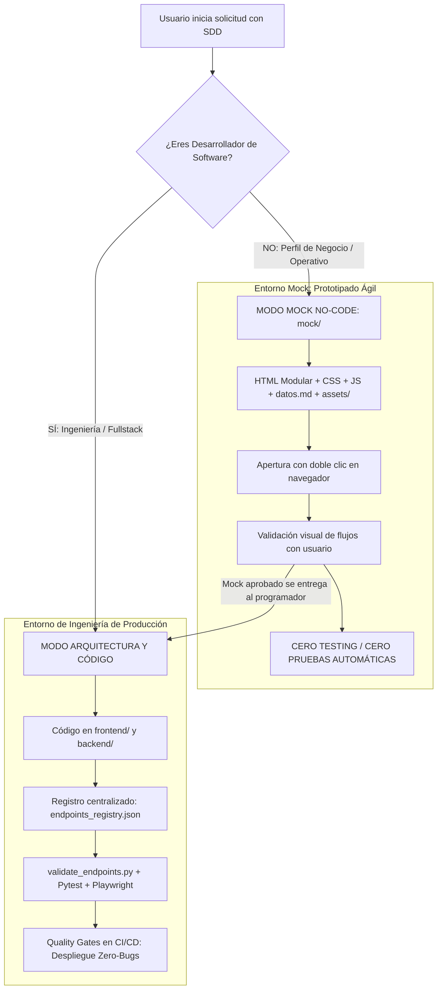
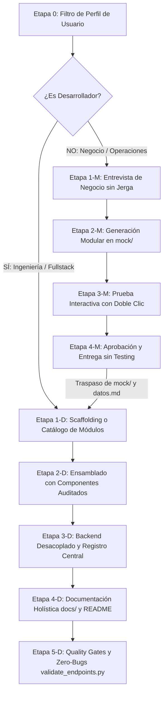

# Metodología SDD — Spec-Driven Development
## Ecosistema Corporativo Greenyard / Jolifoods
### Estándar Oficial de Ingeniería, Prototipado No-Code y Aseguramiento de Calidad

Repositorio oficial y estándar de ingeniería de software guiado por especificaciones (**Spec-Driven Development - SDD**). Diseñado para ser agnóstico, modular y 100% portable tanto para desarrolladores e ingenieros de software como para personas no técnicas (líderes de área, analistas de negocio) y agentes autónomos de Inteligencia Artificial.

---

## 🎯 1. ¿Qué es SDD?

**Spec-Driven Development (SDD)** es un marco de trabajo de ingeniería integral donde los requerimientos, contratos de datos, prototipos interactivos, lineamientos de seguridad, observabilidad, pruebas automatizadas y despliegue se definen formalmente de manera previa a la implementación en código fuente.

Permite a las organizaciones:
1. **Separar la concepción de la implementación**: Los usuarios no técnicos validan prototipos interactivos antes de escribir backend o frontend.
2. **Erradicar el retrabajo y la ambigüedad**: Especificaciones atómicas con contratos TypeScript y esquemas Pydantic/Django.
3. **Garantizar calidad Cero-Bugs**: Validación previa de endpoints, Quality Gates en CI/CD y trazabilidad extremo a extremo.
4. **Fomentar la mejora continua**: Medición de adopción in-app, encuestas a usuarios y evolución guiada por datos.

---

## 📂 2. Nueva Jerarquía y Estructura del Ecosistema

```text
.sdd/
├── assets/                                  # Identidad corporativa, logos SVG y recursos visuales oficiales
│   ├── Jolifoods.svg                        # Logotipo completo vectorizado
│   ├── Joli.svg                             # Isotipo oficial vectorizado
│   └── logoJoli.png                         # Logotipo de respaldo en mapa de bits
│
├── components/                              # Catálogo de 36 suites UI/UX desacopladas y reutilizables
│   ├── badge/                               # Badges semánticos de estado y rol
│   ├── biometrics/                          # Escáner biométrico facial WebRTC con máscara oval (contenedores)
│   ├── button/                              # Icon action groups (28px toolbar, 26px fila agrupada)
│   ├── calendar/                            # Calendario mensual corporativo de turnos (vibra)
│   ├── card/                                # [NUEVO] CorporateCard (Header, Body, Footer desacoplados)
│   ├── charts/                              # Gráficas estándar y [NUEVO] Advanced Analytics (Gantt, Radar, Gauge, Sankey)
│   ├── context/                             # AuthContext, RBAC y sincronización de tema Noche/Día
│   ├── dashboard/                           # [NUEVO] PlatformUsageDashboard (telemetría de uso y encuestas in-app)
│   ├── data_table/                          # Tabla tipo Excel con ChecklistPopover, ColumnResizer y ColumnVisibility
│   ├── drawer/                              # Right Sidebar Drawer para CRUDs y detalles (prohibido modales para formularios)
│   ├── dropdown/                            # SelectFilter con búsqueda integrada y filtros de cabecera
│   ├── empty_state/                         # Estados vacíos ilustrados con llamadas a la acción
│   ├── error_boundary/                      # Resiliencia ante caídas y auto-recarga ante ChunkLoadError
│   ├── export/                              # Exportación a Excel (.xlsx) con auto-anchos
│   ├── kpi/                                 # Tarjetas KPI con halo cromático y filtro cruzado
│   ├── layout/                              # TopNavbar, UserProfileDropdown y Reglas 100% Horizontal
│   ├── loader/                              # PageLoader con isotipo Jolifoods y Skeletons shimmer
│   ├── login/                               # Suite de autenticación, Microsoft SSO M365, recovery y logos
│   ├── modal/                               # ConfirmModal, ModalDialog y [NUEVO] ProModal (Seguridad OTP, Wizard, Split)
│   ├── notification/                        # NotificationPopover en TopHeader con pestañas multi-categoría
│   ├── pagination/                          # Paginador superior integrado en toolbar de tabla
│   ├── pdf/                                 # Visor Canvas de PDF con efecto de hojas físicas apiladas (tiendita)
│   ├── pwa/                                 # Banner de instalación PWA no invasivo y modo kiosk (porterias)
│   ├── realtime/                            # Arquitectura Smart Polling en JavaScript con AbortController (app_tic)
│   ├── routing/                             # ProtectedRoute con validación declarativa de roles RBAC
│   ├── scanner/                             # Escáner de código de barras y QR con html5-qrcode (contenedores)
│   ├── services/                            # Cliente Axios dual y [NUEVO] Endpoints Registry centralizado
│   ├── signature/                           # SignatureModal táctil y [NUEVO] MultiPartySignature criptográfico
│   ├── stepper/                             # [NUEVO] StepperWizard de procesos secuenciales por etapas
│   ├── timeline/                            # [NUEVO] ActivityTimeline de auditoría y tracking de estados
│   ├── toast/                               # Toast Notification Sonner con tokens Jolifoods
│   ├── toggle/                              # Interruptor conmutador interactivo esmeralda accesible
│   ├── tooltip/                             # TruncatedTooltip para celdas con elipsis sin romper layout
│   ├── tutorial/                            # [NUEVO] SplitTutorialWalkthrough (tutorial interactivo dividido estándar bi)
│   ├── upload/                              # [NUEVO] FileUploaderPro (Drag & Drop, Hash SHA-256 local y magic bytes)
│   ├── mockup_template.html                 # Plantilla maestra de prototipado rápido
│   └── variables.css                        # Tokens canónicos CSS (Modo Noche y Modo Día)
│
├── greenfield/                              # Normativas maestras, protocolos de ingeniería y guías
│   ├── 00_normativa_buenas_practicas_y_auditoria.md          # Las 10 BP obligatorias (Score 100/100)
│   ├── 01_calificacion_final_ecosistema_sdd.md               # Auditoría de madurez y evaluación de ingeniería
│   ├── 02_catalogo_y_menu_de_complementos.md                 # Catálogo interactivo con 32 complementos
│   ├── 03_asistente_interactivo_diseno_paginas.md            # Entrevista guiada paso a paso para nuevas pantallas
│   ├── 04_menus_de_seleccion_por_componente.md               # Menús de personalización por componente UI
│   ├── 05_metodologia_mocks_no_programadores.md              # Flujo No-Code para clientes de negocio
│   ├── 06_protocolo_devops_cicd_y_calidad.md                 # Pre-commit, SemVer, Quality Gates y Git Flow
│   ├── 07_protocolo_observabilidad_telemetria_apm.md          # OpenTelemetry, Correlation IDs, SLOs y healthchecks
│   ├── 08_protocolo_migraciones_zero_downtime.md              # Patrón Expand & Contract, Celery y RPO/RTO
│   ├── 09_protocolo_gobernanza_apis_y_breaking_changes.md     # Versionado URI, verificación oasdiff y cabecera Sunset
│   ├── 10_protocolo_incidentes_sre_y_postmortem.md            # Severidades SEV-1 a SEV-3, War Room y Blameless Post-Mortem
│   ├── 11_protocolo_pruebas_automaticas_y_testing_e2e.md      # Pytest, Playwright, Zero-Bugs y exención Mock
│   ├── 12_protocolo_ciclo_de_vida_sdlc_y_mejora_continua.md   # Las 7 fases del software, roles Técnico vs Senior y RICE
│   ├── 13_catalogo_innovaciones_y_mejores_practicas_proyectos.md # Lo mejor de los 8 proyectos del ecosistema
│   ├── SPEC_GUIDE.md                                         # Guía maestra de desarrollo y prompt protocol
│   └── pages/                                                # Especificaciones canónicas por página
│
├── mock/                                    # Entorno de prototipado interactivo No-Code (Doble clic, cero dependencias)
│   ├── README.md                            # Guía del entorno mock y regla de cero testing
│   ├── mock_template_with_json.html         # Plantilla interactiva con iteración de array JSON
│   ├── plantilla_datos_necesarios.md        # Plantilla Markdown de contrato de datos para el backend
│   └── dashboard_ventas/                    # Ejemplo modular (HTML + CSS + JS + datos.md + assets/)
│
├── model/                                   # Esquemas canónicos de base de datos (PostgreSQL y Django ORM)
│
└── stack/                                   # Plantilla de arquitectura backend/frontend
    ├── init_project.py                      # Scaffolding de proyectos (crea backend/media/ y endpoints_registry.json)
    ├── settings_security_template.py        # Configuración blindada con rutas relativas (BASE_DIR)
    ├── endpoints_registry_template.json     # Manifiesto centralizado de rutas del sistema
    └── validate_endpoints.py                # Validador universal de endpoints, cURLs y Quality Gate CI/CD
```

---

## 🛡️ 3. Las 17 Buenas Prácticas Inflexibles de Ingeniería (Normativa 00)

Todo proyecto o módulo del ecosistema debe cumplir estrictamente estas 17 normas para obtener conformidad técnica (100/100):

| Código | Dimensión | Regla Inflexible | Implementación Técnica Obligatoria |
|:---|:---|:---|:---|
| **BP-01** | **Aislamiento `DEBUG`** | Prohibido `DEBUG=True` en producción. Cero secretos en código. | Leer estrictamente de `.env`. Lanzar excepción fatal si falta `SECRET_KEY` o credenciales. |
| **BP-02** | **Blindaje de Hosts** | Prohibido `ALLOWED_HOSTS = ['*']`. | Lista explícita de dominios Jolifoods e IPs permitidas desde `.env`. |
| **BP-03** | **Control CORS** | Prohibido `CORS_ALLOW_ALL_ORIGINS = True`. | Restringido exclusivamente a orígenes del frontend (`http://localhost:5173`, `https://*.jolifoods.com`). |
| **BP-04** | **Rate Limiting** | Proteger endpoints contra fuerza bruta y DoS. | Limitación distribuida con **Redis**: 5 req/min login, 30 req/min anónimos, 120 req/min autenticados. Retorno `Retry-After`. |
| **BP-05** | **Principio Deny-by-Default** | Todo endpoint es privado por defecto salvo excepción explícita. | `IsAuthenticated` global en Django y dependencias de autenticación mandatorias en FastAPI. |
| **BP-06** | **Hardening HTTP y Cookies** | Protección perimetral contra XSS, Clickjacking y Sniffing. | `X_FRAME_OPTIONS = 'DENY'`, `NOSNIFF = True`, cookies `HttpOnly=True`, `SameSite='Lax'`, HSTS en producción. |
| **BP-07** | **Rutas 100% Relativas** | Prohibido cablear rutas absolutas de disco (`C:\...`, `/home/...`) o dominios fijos en código. | Todo asset, media o import debe resolverse relativamente con `Path(__file__).resolve().parent.parent` (`BASE_DIR`). |
| **BP-08** | **Carpeta `backend/media/`** | Estandarizar la ubicación de subida para cualquier archivo (firmas, PDFs, fotos). | Crear siempre `backend/media/` con `.gitkeep`, montar volumen Docker `./backend/media:/app/media` y exponer vía `MEDIA_ROOT`. |
| **BP-09** | **Centralización de Endpoints** | Prohibido terminantemente quemar rutas HTTP en componentes React o vistas. | Vistas consumen `src/services/endpoints.ts` y backend/pipelines consumen `backend/config/endpoints_registry.json`. |
| **BP-10** | **Exención de Testing en Modo Mock** | Prohibido e innecesario correr testing automatizado o validadores sobre prototipos `mock/`. | Los mocks son simulaciones visuales estáticas (HTML/CSS/JS) sin servidor real ni base de datos conectada. El testing aplica exclusivamente al desarrollo en código. |
| **BP-11** | **Prohibición de Ciclos `for` Anidados** | Prohibido anidar bucles `for` ($O(N^2)$ / $O(N \times M)$) y ejecutar queries dentro de ciclos. | Usar diccionarios Hash en memoria ($O(1)$) reduciendo a $O(N + M)$, o cruzar datos en el motor SQL (`JOIN`, `prefetch_related`, `annotate`). |
| **BP-12** | **Transaccionalidad Atómica** | Prohibido ejecutar escrituras dependientes sin control transaccional. | Envolver 2 o más mutaciones en `with transaction.atomic():` para evitar estados corruptos o huérfanos. |
| **BP-13** | **Persistencia en Bloque** | Prohibido invocar `.save()` o `.create()` individual en bucles. | Utilizar `bulk_create(batch_size=500)` y `bulk_update()` en un único viaje de red SQL. |
| **BP-14** | **Integridad de Código** | Prohibido truncar código o dejar placeholders tipo `// ... resto ...`. | Entregar siempre archivos 100% íntegros y respetando la lógica previa del módulo. |
| **BP-15** | **Aislamiento en `.venv`** | Prohibido ejecutar `pip` o `python` en el entorno global del equipo. | Operar exclusivamente dentro del entorno virtual `.venv` (`.\.venv\Scripts\python.exe`). |
| **BP-16** | **Documentación de Capacidades y Destino** | Prohibido redactar bitácoras de micro-cambios puntuales. | Documentar todo lo que realiza la aplicación en `docs/` y el destino global de la plataforma en `README.md`. |
| **BP-17** | **Carpeta Raíz `pruebas/`** | Prohibido crear archivos o carpetas de pruebas dentro de `backend/`. | En Greenfield, toda suite de pruebas debe ubicarse en la carpeta raíz `pruebas/` (`<project-root>/pruebas/`), manteniendo limpio `backend/`. |

---

## 🎨 4. Regla de Oro: Modo Mock No-Code vs Modo Desarrollo Técnico

El SDD implementa una bifurcación de roles clara desde el **Paso 0**:



> [!NOTE]
> **¿Por qué NO hay testing en el Modo Mock?**  
> Porque por definición un mock es un **prototipo estático interactivo** para validar con personas de negocio la ergonomía, los KPIs y las columnas antes de invertir horas de ingeniería. No cuenta con servidor Django/FastAPI encendido ni base de datos PostgreSQL, por lo que exigir pruebas automáticas sería un contrasentido técnico.

---

## 🚀 5. Catálogo Centralizado de Endpoints y Validador Universal (`validate_endpoints.py`)

Para erradicar el problema de tener rutas HTTP quemadas en decenas de vistas y componentes React dispersos, el SDD establece una **arquitectura de registro único**:

### 5.1. Arquitectura de Registro Único
1. **En Frontend (`src/services/endpoints.ts`)**:
   Todas las URLs del sistema se exportan tipadas desde un único archivo central:
   ```typescript
   export const ENDPOINTS = {
     AUTH: { LOGIN: '/api/v1/auth/login/', LOGOUT: '/api/v1/auth/logout/' },
     METRICAS: { KPI_CARTERA: '/fast/v1/metricas/kpi/', RESUMEN: '/fast/v1/metricas/resumen/' },
     USUARIOS: { LIST: '/api/v1/usuarios/', DETAIL: (id: number) => `/api/v1/usuarios/${id}/` }
   } as const;
   ```
2. **En Backend / CI (`backend/config/endpoints_registry.json`)**:
   Manifiesto formal con métodos, roles requeridos y contratos esperados.

### 5.2. Validador Autónomo en Python (`stack/validate_endpoints.py`)
Herramienta universal de auditoría construida en Python puro (**cero dependencias externas**, compatible con Windows UTF-8/cp1252 y Linux):

```bash
# 1. Auditar todas las rutas del proyecto en una sola pasada contra servidor local
python backend/validate_endpoints.py --base-url http://localhost:8000

# 2. Auditar ambiente desplegado, verificar auth y exportar cURLs ejecutables para Postman
python backend/validate_endpoints.py \
  --base-url https://apptic.jolifoods.co \
  --endpoints-file backend/config/endpoints_registry.json \
  --login-doc "12345678" \
  --login-pass "ClaveSegura2026!" \
  --export-curls test_curls.sh \
  --json-report reporte_auditoria.json
```

**Capacidades automáticas del validador**:
- Audita endpoints públicos y autenticados (verificando tokens Bearer).
- Valida cabeceras de seguridad perimetral (`X-Frame-Options: DENY`, `nosniff`, HSTS).
- Evalúa el SLO de rendimiento (alerta si `/fast/` supera 45ms o endpoints estándar superan 500ms).
- Genera comandos `curl -X ...` listos para reproducir cualquier prueba manual.
- **Retorno para CI/CD**: Devuelve `exit code 0` si todos los tests pasan, o `exit code 1` para frenar despliegues con bugs antes de tocar producción.

---

## 📊 6. Las 14 Normativas y Protocolos Oficiales del SDD

| # | Protocolo Oficial | Propósito y Alcance de Ingeniería |
|:---:|:---|:---|
| **00** | [Normativa Maestra y Auditoría](greenfield/00_normativa_buenas_practicas_y_auditoria.md) | Las 10 BP obligatorias, OWASP 35/35, erradicación de N+1, regla 100% Horizontal, rutas relativas y `backend/media/`. |
| **01** | [Calificación Final del Ecosistema](greenfield/01_calificacion_final_ecosistema_sdd.md) | Matriz de madurez técnica, pentesting OWASP y evaluación de los proyectos de producción. |
| **02** | [Catálogo y Menú de Complementos](greenfield/02_catalogo_y_menu_de_complementos.md) | Catálogo interactivo con 32 complementos de negocio listos para instanciar en proyectos. |
| **03** | [Asistente Interactivo de Páginas](greenfield/03_asistente_interactivo_diseno_paginas.md) | Protocolo de preguntas paso a paso para diseñar módulos sin ambigüedad. |
| **04** | [Menús de Selección por Componente](greenfield/04_menus_de_seleccion_por_componente.md) | Opciones de personalización para KPIs, Tablas, Drawers, Modales, Filtros y Tutoriales. |
| **05** | [Metodología de Mocks para No Programadores](greenfield/05_metodologia_mocks_no_programadores.md) | Flujo No-Code de 4 archivos modulares con array JSON y regla de cero testing en prototipos. |
| **06** | [DevOps, CI/CD y Quality Gates](greenfield/06_protocolo_devops_cicd_y_calidad.md) | Pre-commit hooks (`ruff`, `black`, `eslint`, `detect-secrets`), Git Flow, SemVer y Quality Gates de CI. |
| **07** | [Observabilidad, Telemetría y APM](greenfield/07_protocolo_observabilidad_telemetria_apm.md) | Trazabilidad distribuida con Correlation ID (`X-Correlation-ID`), healthchecks y métricas SLO. |
| **08** | [Migraciones Zero-Downtime y Resiliencia](greenfield/08_protocolo_migraciones_zero_downtime.md) | Patrón Expand & Contract, lotes Celery para tablas masivas, RPO < 15 min y RTO < 30 min. |
| **09** | [Gobernanza de APIs y Breaking Changes](greenfield/09_protocolo_gobernanza_apis_y_breaking_changes.md) | Versionado URI, verificación `oasdiff` en CI/CD y cabecera RFC Sunset (90 días de deprecación). |
| **10** | [Incidentes SRE y Blameless Post-Mortem](greenfield/10_protocolo_incidentes_sre_y_postmortem.md) | Clasificación de severidades (SEV-1 a SEV-3), mando de War Room y autopsias sin culpa (5 Porqués). |
| **11** | [Pruebas Automáticas y Calidad Cero-Bugs](greenfield/11_protocolo_pruebas_automaticas_y_testing_e2e.md) | Suite Pytest, Playwright E2E, cobertura > 80%, `validate_endpoints.py` y exención de testing en mocks. |
| **12** | [Ciclo de Vida (SDLC) y Mejora Continua](greenfield/12_protocolo_ciclo_de_vida_sdlc_y_mejora_continua.md) | Las 7 fases del software, diferenciación roles Técnico vs Senior, RICE y encuestas in-app. |
| **13** | [Innovaciones de Proyectos del Ecosistema](greenfield/13_catalogo_innovaciones_y_mejores_practicas_proyectos.md) | Catálogo de innovaciones extraídas de los 8 proyectos del ecosistema Jolifoods. |

---

## 🧩 7. Nuevos Complementos Empresariales Disponibles

1. **`CorporateCard` ([`card/corporate_card.md`](components/card/corporate_card.md))**:
   Contenedor estructurado con Header (título, subtítulo, badges y halo cromático), Body fluido y Footer con metadatos de sincronización y botones agrupados.
2. **`ProModal` ([`modal/advanced_pro_modal.md`](components/modal/advanced_pro_modal.md))**:
   Modales avanzados de alta seguridad: confirmación por contraseña o código OTP, Wizard multi-paso con barra de progreso y Split-Screen Master-Detail.
3. **`MultiPartySignature` ([`signature/multi_party_signature.md`](components/signature/multi_party_signature.md))**:
   Firma digital para actas y acuerdos con múltiples firmantes, sellado ISO, hash SHA-256 de integridad, geolocalización, IP y marcas de agua.
4. **`AdvancedAnalyticsCharts` ([`charts/advanced_analytics_charts.md`](components/charts/advanced_analytics_charts.md))**:
   Visualizaciones analíticas de alta densidad: Diagramas de Gantt interactivos, gráficos Radar/Spider 360°, medidores Gauge de cumplimiento de metas/SLAs, diagramas Sankey de flujo y Heatmaps.
5. **`FileUploaderPro` ([`upload/file_uploader_pro.md`](components/upload/file_uploader_pro.md))**:
   Cargador masivo Drag & Drop con deduplicación por hash SHA-256 en el cliente, barras de progreso individual y validación estricta de formato por magic bytes.
6. **`ActivityTimeline` ([`timeline/activity_timeline.md`](components/timeline/activity_timeline.md))**:
   Línea de tiempo vertical para auditoría y bitácora de novedades, con nodos de estado por color, avatares, diferencias de cambios (diff) y metadatos formateados.
7. **`StepperWizard` ([`stepper/stepper_wizard.md`](components/stepper/stepper_wizard.md))**:
   Asistente secuencial numerado para flujos extensos de configuración y onboarding, con validación por esquema Zod en cada etapa.
8. **`PlatformUsageDashboard` ([`dashboard/platform_usage_dashboard.md`](components/dashboard/platform_usage_dashboard.md))**:
   Panel de telemetría de adopción: usuarios activos (DAU/MAU), tiempo de sesión, ranking de módulos más y menos usados, y widget flotante `InAppFeedbackWidget` para micro-encuestas a usuarios.
9. **`SplitTutorialWalkthrough` ([`tutorial/split_tutorial_walkthrough.md`](components/tutorial/split_tutorial_walkthrough.md))**:
   Tutorial interactivo dividido con panel izquierdo fijo (credenciales de base de datos o código) y panel derecho con carrusel de pasos, capturas de pantalla, zoom Lightbox y resaltado automático de texto entre comillas (estándar extraído de `bi/datahub`).
10. **`EndpointsRegistry` ([`services/endpoints_registry.md`](components/services/endpoints_registry.md))**:
    Patrón de centralización de rutas de servicio (`endpoints.ts` y `endpoints_registry.json`) para desacoplar el consumo de APIs del diseño visual.

### 7.1. 🌳 Árbol Estructurado del Catálogo de Complementos y Suites UI/UX (`components/`)

Todas las 36 suites de componentes de la metodología SDD se encuentran desacopladas y tipadas dentro del directorio `components/`:

```text
components/
├── 📁 layout/                                   # Layout y Arquitectura Visual 100% Horizontal
│   ├── navbar.md                                # TopNavbar horizontal con título y marca a la izquierda
│   ├── layout_rules.md                          # Regla Inflexible 100% Horizontal (Prohibido centrar vistas)
│   ├── user_profile_dropdown.md                 # Dropdown de sesión en TopHeader con confirmación de salida
│   └── sidebar.md                               # Sidebar colapsable de navegación (Opcional, Full-Width por defecto)
│
├── 📁 data_table/                               # Tablas y Listados de Alta Densidad Tipo Excel
│   ├── data_table.md                            # Data Table con paginación server-side y buscador reactivo
│   ├── checklist_popover.md                     # Filtros por columna tipo Excel (A-Z/Z-A, buscador, botón 'Solo')
│   ├── column_resizer.md                        # Ajuste interactivo de ancho en <th> con persistencia local
│   └── column_visibility.md                     # Selector desplegable de columnas visibles (Columns3)
│
├── 📁 drawer/                                   # Paneles Laterales CRUD Deslizantes (Obligatorio)
│   └── drawer.md                                # Right Sidebar Drawer (560px) con pie fijo (Prohibido modales para CRUD)
│
├── 📁 modal/                                    # Diálogos y Modales de Seguridad
│   ├── confirm_modal.md                         # ConfirmModal con justificación obligatoria de 10 caracteres
│   ├── modal_dialog.md                          # Diálogo accesible estándar (variantes sm, md, lg, xl con portal)
│   ├── advanced_pro_modal.md                    # ProModal (Doble verificación OTP, Wizard y Split-Screen)
│   └── session_expiration_modal.md              # Modal desacoplado ante evento global 401 de expiración
│
├── 📁 kpi/ & card/                              # Métricas de Cabecera y Contenedores Estructurados
│   ├── kpi/kpi_cards.md                         # Tarjetas KPI con halo cromático y filtrado cruzado interactivo
│   └── card/corporate_card.md                   # CorporateCard (Header con badges, Body fluido y Footer con metadata)
│
├── 📁 dropdown/, button/ & toggle/              # Formularios y Controles Semánticos
│   ├── dropdown/select_filter.md                # Searchable SelectFilter con búsqueda en vivo (reemplazo de <select>)
│   ├── dropdown/expandable_filter_group.md      # Barra de filtros expandibles horizontales con botón FilterX
│   ├── toggle/toggle_switch.md                  # Interruptor conmutador interactivo esmeralda accesible
│   ├── button/icon_action_group.md              # Action groups compactos (28px en toolbar, 26px en fila agrupada)
│   ├── button/button_primary.md                 # Botón de acción primaria con esmeralda glow y spinner Lucide
│   └── login/input_field.md                     # Inputs corporativos con icono prefijo y botón ojo de visibilidad
│
├── 📁 charts/                                   # Visualización Analítica y Gráficas de Datos
│   ├── charts/analytics_charts.md               # Área con gradiente, barras verticales redondeadas, donut porcentual
│   └── charts/advanced_analytics_charts.md      # Diagramas de Gantt, Radar 360°, Gauge SLA, Sankey y Heatmaps
│
├── 📁 roles/ & security/                        # Gobernanza, Seguridad y Control de Acceso (RBAC)
│   ├── roles/roles_admin_sidebar.md             # RolesAdminSidebar para administración de permisos dinámicos en caliente
│   ├── login/button_microsoft.md                # Botón oficial Microsoft SSO M365 (SVG cuadrícula 4 colores)
│   ├── login/login_form.md                      # Formulario ensamblado de autenticación híbrida y remember-me
│   ├── login/recovery_form.md                   # Flujo de recuperación de contraseña con token temporal
│   ├── routing/protected_route.md               # ProtectedRoute con validación declarativa de permisos RBAC
│   ├── context/auth_context.md                  # AuthContext global con sincronización reactiva de tokens y tema
│   └── signature/multi_party_signature.md       # Firma digital de múltiples partes con sellado ISO, IP y SHA-256
│
├── 📁 biometrics/, scanner/, pdf/ & upload/     # Multimedia, Hardware y Captura de Evidencias
│   ├── biometrics/facial_scanner.md             # Escáner biométrico facial WebRTC con guía oval y cortinilla
│   ├── scanner/scanner_modal.md                 # Lector de códigos de barra y QR integrado con html5-qrcode
│   ├── pdf/pdf_preview_frame.md                 # Visor Canvas de documentos PDF simulando hojas físicas apiladas
│   ├── signature/signature_modal.md             # Captura táctil de firma con algoritmo de auto-recorte (cropToSignature)
│   └── upload/file_uploader_pro.md              # Cargador masivo Drag & Drop con cálculo de hash SHA-256 local
│
└── 📁 feedback_and_telemetry/                   # Notificaciones, Experiencia de Usuario y Telemetría
    ├── toast/toast_notification.md              # Toast Notification Sonner con tokens Jolifoods
    ├── notification/notification_popover.md     # Centro de multi-notificaciones desplegable en TopHeader por pestañas
    ├── stepper/stepper_wizard.md                # StepperWizard de procesos secuenciales por etapas numeradas
    ├── timeline/activity_timeline.md            # ActivityTimeline vertical para auditoría y bitácora cronológica
    ├── tutorial/split_tutorial_walkthrough.md   # Tutorial interactivo dividido (Split Screen con zoom Lightbox)
    ├── dashboard/platform_usage_dashboard.md   # Telemetría de adopción (DAU/MAU) y widget de encuestas in-app
    ├── pagination/pagination.md                 # Paginador superior integrado en toolbar de tabla
    ├── empty_state/empty_state.md               # Estados vacíos ilustrados con botones de llamada a la acción (CTA)
    ├── error_boundary/error_boundary.md         # ErrorBoundary global con auto-recarga controlada ante ChunkLoadError
    ├── pwa/pwa_install_banner.md                # Banner PWA de instalación no invasivo y modo kiosk standalone
    ├── realtime/js_polling_architecture.md     # Smart Polling reactivo en JS con AbortController y visibilityState
    └── tooltip/truncated_tooltip.md             # Tooltip inteligente para lectura de celdas con elipsis sin romper layout
```

---

## 💡 8. Catálogo de Innovaciones y Árboles de Arquitectura por Sistema

La metodología SDD se nutre de las mejores soluciones de ingeniería probadas en los **8 proyectos del ecosistema Jolifoods**. A continuación se detalla el árbol de arquitectura canónico y las innovaciones de cada sistema:

---

### 8.1. Proyecto `bi` (Business Intelligence & Datahub)
- **Innovaciones**: Tutorial interactivo dividido (`SplitTutorialModal`), módulo de calidad de datos (*Data Quality DQ*), gestión de tickets PQRS y autenticación híbrida con fallback seguro de token en URL (`?token=`) para herramientas externas (Power BI / Excel).

```text
bi/
├── frontend/                                    # SPA en React + Vite
│   ├── src/
│   │   ├── components/
│   │   │   ├── tutorial/                        # SplitTutorialModal y TutorialChooserModal
│   │   │   ├── data_quality/                    # DataQualityGrid, DQRulesModal y métricas
│   │   │   ├── pqrs/                            # Tickets de analítica y peticiones
│   │   │   └── data_table/                      # Toolbar superior con paginador integrado
│   │   ├── services/
│   │   │   ├── endpoints.ts                     # Catálogo centralizado de rutas
│   │   │   └── apiClient.ts                     # Cliente Axios dual (/api/ y /fast/)
│   │   └── context/
│   │       └── AuthContext.tsx                  # Sesión con soporte de sliding session
│   └── package.json
│
├── backend/                                     # Servidor híbrido ASGI (Django + FastAPI)
│   ├── config/
│   │   ├── endpoints_registry.json              # Manifiesto formal de endpoints para auditoría
│   │   └── asgi.py                              # Servidor ASGI híbrido bajo un solo proceso
│   ├── core/
│   │   ├── authentication.py                    # TokenAuthentication con fallback en query param ?token=
│   │   └── settings.py                          # Configuración blindada OWASP con BASE_DIR
│   ├── apps/
│   │   ├── datahub/                             # Vistas de alto rendimiento /fast con pooling PostgreSQL
│   │   ├── pqrs/                                # Modelos y endpoints de peticiones y reclamos
│   │   └── usuarios/                            # Gestión de usuarios y perfiles
│   ├── media/                                   # Carpeta canónica con .gitkeep para descargas
│   └── validate_endpoints.py                    # Validador de rutas y contratos en CI/CD
└── docker-compose.yml                           # Contenedores de PostgreSQL, Redis, Frontend y Backend
```

---

### 8.2. Proyecto `app_tic` (Mesa de Ayuda, MCP & Gestión Ágil de Proyectos)
- **Innovaciones**: Gobernanza de proyectos en cuadrícula (`GridTIC` con Hitos, Sprints, Decisiones ADRs, Compromisos y Tareas), integración nativa con agentes autónomos de IA mediante **Model Context Protocol (MCP)**, módulo ACPM de acciones de mejora y Smart Polling reactivo con `AbortController`.

```text
app_tic/
├── frontend/                                    # SPA React con Tailwind + Tokens Jolifoods
│   ├── src/
│   │   ├── components/
│   │   │   ├── grid_tic/                        # Cuadrícula de 6 entidades: Hitos, Sprints, ADRs, Tareas
│   │   │   ├── acpm/                            # Formulario de acciones correctivas y preventivas
│   │   │   └── timeline/                        # ActivityTimeline de auditoría de sprints
│   │   ├── hooks/
│   │   │   └── useSmartPolling.ts               # Smart Polling con AbortController y visibilityState
│   │   └── services/
│   │       └── endpoints.ts                     # Rutas centralizadas de proyectos y ACPM
│   └── vite.config.ts
│
├── backend/                                     # Backend Django REST Framework + FastAPI
│   ├── mcp/                                     # Servidor Model Context Protocol para Agentes de IA
│   │   ├── server.py                            # Exposición de herramientas autónomas para la IA
│   │   └── tools/                               # Tools: proyectos_tasks_*, proyectos_decisions_*, acpm_*
│   ├── apps/
│   │   ├── proyectos/                           # Modelos de Proyectos, Hitos, Sprints, ADRs y Compromisos
│   │   ├── acpm/                                # Registro formal con consecutivos y causa raíz
│   │   └── auditoria/                           # Bitácora inmutable de transacciones
│   ├── media/                                   # Evidencias fotográficas y adjuntos ACPM (.gitkeep)
│   └── validate_endpoints.py                    # Validador de endpoints de mesa de ayuda
└── pruebas/                                     # Suite de pruebas Pytest y E2E Playwright
```

---

### 8.3. Proyecto `tiendita` (Entrega de Dotaciones, Firma Digital & Puntos)
- **Innovaciones**: Gobernanza de roles en tiempo real (`RolesAdminSidebar` con unión booleana en caliente y refresco reactivo cada 5s), firma digital táctil con algoritmo de auto-recorte (`cropToSignature`), visor de PDFs en Canvas con efecto de hojas físicas apiladas y lector de códigos de barra / QR con `html5-qrcode`.

```text
tiendita/
├── frontend/                                    # React + Vite con Canvas y Web APIs
│   ├── src/
│   │   ├── components/
│   │   │   ├── roles/                           # RolesAdminSidebar (drawer de permisos por grupo)
│   │   │   ├── signature/                       # SignatureModal táctil con recorte de bordes transparentes
│   │   │   ├── pdf/                             # PdfPreviewFrame con Canvas y hojas apiladas (pdfjs-dist)
│   │   │   ├── scanner/                         # ScannerModal de códigos de barras y QR con cámara
│   │   │   └── entrega/                         # EntregaTypeModal (despacho domicilio vs presencial)
│   │   ├── context/
│   │   │   └── AuthContext.tsx                  # Polling dinámico de permisos cada 5s sin deslogueo
│   │   └── services/
│   │       └── endpoints.ts                     # Endpoints de dotaciones, firmas y entregas
│   └── package.json
│
├── backend/                                     # Backend Django + FastAPI
│   ├── apps/
│   │   ├── dotaciones/                          # Gestión de tallas, kits corporativos y entregas
│   │   ├── roles/                               # Modelo Rol con permisos: JSONField y ManyToMany
│   │   └── evidencias/                          # Persistencia de firmas PNG Base64 y actas PDF
│   ├── media/                                   # backend/media/ montado para actas y firmas (.gitkeep)
│   └── validate_endpoints.py                    # Auditoría de endpoints de dotaciones
└── docker-compose.yml
```

---

### 8.4. Proyecto `vibra` (Turnos, Calendario de Cuadrillas & Talento Humano)
- **Innovaciones**: Calendario corporativo mensual con rejilla inteligente y badges cromáticos por turno de trabajo (`CorporateCalendar`), centro de notificaciones desplegable en TopHeader con segmentación por pestañas y perfil de colaborador con distinciones.

```text
vibra/
├── frontend/                                    # React + Vite
│   ├── src/
│   │   ├── components/
│   │   │   ├── calendar/                        # CorporateCalendar mensual inteligente con badges de color
│   │   │   ├── notification/                    # NotificationPopover con pestañas en TopHeader
│   │   │   └── talent/                          # Perfil de colaborador y muro de reconocimientos
│   │   └── services/
│   │       └── endpoints.ts                     # Rutas de turnos, cuadrillas y novedades
│   └── package.json
│
├── backend/                                     # Django REST Framework + PostgreSQL
│   ├── apps/
│   │   ├── turnos/                              # Asignación de turnos rotativos y validación de solapes
│   │   ├── novedades/                           # Incapacidades, permisos, vacaciones y licencias
│   │   └── colaboradores/                       # Perfiles de colaboradores y áreas operativas
│   ├── media/                                   # Soportes médicos y comprobantes (.gitkeep)
│   └── validate_endpoints.py                    # Validador de rutas del calendario
└── docker-compose.yml
```

---

### 8.5. Proyecto `contenedores` (Control de Acceso, Biometría Facial & Logística)
- **Innovaciones**: Escáner biométrico facial WebRTC con cortinilla oval interactiva (`FacialScanner`), cálculo de cubicaje volumétrico de carga en bodega y checklist de inspección física de cerraduras y sellos con fotografía móvil.

```text
contenedores/
├── frontend/                                    # React SPA optimizada para terminales y móviles
│   ├── src/
│   │   ├── components/
│   │   │   ├── biometrics/                      # FacialScanner WebRTC con máscara oval y switch de cámara
│   │   │   ├── cubicaje/                        # Calculadora volumétrica de cubicaje de contenedores
│   │   │   └── inspeccion/                      # Checklist con captura fotográfica de sellos
│   │   └── services/
│   │       └── endpoints.ts                     # Rutas de inspección y registro biométrico
│   └── package.json
│
├── backend/                                     # Django + FastAPI de alto rendimiento
│   ├── apps/
│   │   ├── inspecciones/                        # Registro de estado de sellos, pisos y cerraduras
│   │   ├── biometria/                           # Verificación fotográfica de conductores
│   │   └── despachos/                           # Autorización de salida de contenedores
│   ├── media/                                   # Fotos de rostros, sellos y daños físicos (.gitkeep)
│   └── validate_endpoints.py                    # Validador de endpoints logísticos
└── docker-compose.yml
```

---

### 8.6. Proyecto `porterias` (Operación en Puntos de Acceso & PWA Kiosk)
- **Innovaciones**: Aplicación PWA con soporte offline para tablets en casetas de seguridad (`PwaInstallBanner`), interfaz táctil optimizada en modo *standalone* para operarios con guantes y check-in/check-out ultrarrápido con botones gigantes.

```text
porterias/
├── frontend/                                    # PWA (Progressive Web App) en React + Vite
│   ├── public/
│   │   ├── manifest.json                        # Manifiesto PWA para instalación standalone
│   │   └── sw.js                                # Service Worker para caché offline
│   ├── src/
│   │   ├── components/
│   │   │   ├── pwa/                             # PwaInstallBanner no invasivo
│   │   │   └── kiosk/                           # Teclado numérico gigante y vista táctil rápida
│   │   └── services/
│   │       └── endpoints.ts                     # Rutas de accesos vehiculares y peatonales
│   └── package.json
│
├── backend/                                     # Django REST + Redis para control de tráfico
│   ├── apps/
│   │   ├── control_acceso/                      # Registro de entradas, salidas y tiempos de permanencia
│   │   ├── vehiculos/                           # Placas, transportadoras y autorizaciones
│   │   └── contratistas/                        # Validación de ARL y seguridad social
│   ├── media/                                   # Fotos de placas y remisiones (.gitkeep)
│   └── validate_endpoints.py                    # Validador de rutas de portería
└── docker-compose.yml
```

---

### 8.7. Proyecto `color` (Laboratorio de Colorimetría - ColorLab)
- **Innovaciones**: Extracción de paletas cromáticas desde imágenes cargadas en Canvas, selectores de color accesibles y algoritmo de formulación de pigmentos reales (`pigmentos.py`) basado en mezcla sustractiva física para tintes alimentarios.

```text
color/
├── frontend/                                    # SPA React (ColorLab)
│   ├── src/
│   │   ├── components/
│   │   │   ├── extractor/                       # ImagePaletteExtractor desde Canvas interactivo
│   │   │   └── picker/                          # Selectores cromáticos con compatibilidad WCAG
│   │   └── services/
│   │       └── endpoints.ts                     # Rutas del laboratorio de mezclas
│   └── package.json
│
├── backend/                                     # FastAPI puro para procesamiento matemático rápido
│   ├── core/
│   │   └── pigmentos.py                         # Algoritmo de mezcla sustractiva y formulación de gotas
│   ├── routers/
│   │   └── colorimetria.py                      # Endpoints de conversión RGB/CMYK y formulaciones
│   ├── media/                                   # Imágenes subidas para análisis cromático (.gitkeep)
│   └── validate_endpoints.py                    # Validador de endpoints del laboratorio
└── docker-compose.yml
```

---

### 8.8. Proyecto `instalador Joli` (Automatización, Scaffolding & Provisionamiento)
- **Innovaciones**: Empaquetado offline en un único archivo ejecutable `.exe` mediante PyInstaller (`.spec`), provisionamiento automatizado de entornos virtuales `.venv` sin contaminar el sistema operativo y soporte para despliegue desde memorias USB o carpetas compartidas sin internet.

```text
instalador_joli/
├── build/                                       # Artefactos temporales de compilación
├── src/
│   ├── scaffolding/                             # Scripts de creación de carpetas y entornos
│   ├── provisioner.py                           # Creación de .venv y descarga de wheels locales
│   └── autorun_builder.py                       # Generador de lanzadores automáticos
├── Instalador_JoliFoods.spec                    # Especificación oficial PyInstaller single-file
├── autorun.inf                                  # Archivo de ejecución para memorias USB corporativas
└── README.md                                    # Guía de empaquetado para personal de soporte
```

---

## 🔄 9. Ciclo de Vida del Software (SDLC) y Mejora Continua

El protocolo [**`12_protocolo_ciclo_de_vida_sdlc_y_mejora_continua.md`**](greenfield/12_protocolo_ciclo_de_vida_sdlc_y_mejora_continua.md) define cómo debe evolucionar cualquier programa informático a través de sus **7 Fases**:

```text
[1. Concepción] ➔ [2. Especificación SDD] ➔ [3. Prototipado Mock] ➔ [4. Desarrollo & Integración]
                                                                                │
[7. Mejora Continua]  [6. Despliegue & Operación]  [5. Validación QA / Zero-Bugs]
```

### Roles y Responsabilidades
- **Rol Técnico (Operación y Estabilidad)**:
  - Mantiene los SLOs (latencia < 45ms, uptime 99.9%).
  - Ejecuta `validate_endpoints.py` y certifica que no haya regresiones ni bugs.
  - Resuelve incidencias SEV-2/SEV-3 y aplica parches de seguridad en dependencias.
- **Rol Senior (Estrategia y Mejora Continua)**:
  - Monitorea la telemetría de adopción en `PlatformUsageDashboard` (qué módulos son más usados y cuáles sufren abandono).
  - Analiza el feedback recolectado mediante `InAppFeedbackWidget` y entrevistas a usuarios.
  - Prioriza nuevas características con el modelo **RICE** (*Reach, Impact, Confidence, Effort*).
  - Programa ciclos y sprints mensuales de refactorización y evolución continua.

---

## 🛠️ 10. Cómo Iniciar un Proyecto con SDD

1. **Copiar la carpeta `.sdd`** en la raíz de tu espacio de trabajo.
2. **Ejecutar el inicializador de proyectos**:
   ```powershell
   python .sdd/stack/init_project.py --name mi_plataforma
   ```
   *El script creará automáticamente el entorno virtual `.venv`, la carpeta `backend/media/` con su `.gitkeep`, el registro centralizado `endpoints_registry.json`, `endpoints.ts` en el frontend y copiará `validate_endpoints.py`.*

3. **Definir el alcance de la interfaz**:
   - Para perfiles no técnicos: seguir [`greenfield/05_metodologia_mocks_no_programadores.md`](greenfield/05_metodologia_mocks_no_programadores.md) dentro de [`mock/`](mock/README.md) (**Cero testing**).
   - Para desarrolladores: seguir [`greenfield/SPEC_GUIDE.md`](greenfield/SPEC_GUIDE.md) y seleccionar complementos de [`greenfield/02_catalogo_y_menu_de_complementos.md`](greenfield/02_catalogo_y_menu_de_complementos.md).

4. **Auditar antes de pasar a producción**:
   ```bash
   python backend/validate_endpoints.py --endpoints-file backend/config/endpoints_registry.json --base-url http://localhost:8000
   ```

---

## 🧭 11. Paso a Paso para Interactuar con el Ecosistema `.sdd`

Cualquier interacción con el estándar SDD —ya sea realizada por un usuario humano o guiada por un agente de Inteligencia Artificial— debe seguir este ciclo estructurado de interacción en **5 Etapas**:



---

### 📍 Paso 0 Obligatorio: Filtro de Perfil de Usuario

Antes de generar especificaciones, maquetas o código, se debe formular la pregunta de identificación de rol:

> *"¿Eres desarrollador de software o tienes un perfil no técnico / de negocio?"*
> 
> - **[1] No soy desarrollador** (Perfil de negocio, operativo o líder funcional) ➔ Activa el **Modo Mock No-Code** en `mock/`.
> - **[2] Sí, soy desarrollador** (Ingeniería, Fullstack, backend o frontend) ➔ Activa el **Modo Arquitectura y Código**.

---

### 🟢 Flujo A: Interacción en Modo Mock No-Code (Perfiles Funcionales)

Este flujo está pensado para que cualquier persona sin conocimientos técnicos diseñe, valide y pruebe interfaces interactivas funcionales antes de invertir tiempo de programación.

#### 1. Entrevista Guiada de Requerimientos (Cero Jerga Técnica)
La persona o la IA responde 6 preguntas esenciales:
- **Proceso / Objetivo**: ¿Qué proceso operativo se desea gestionar? *(Agnóstico: puede ser inventario de fruta, despacho de camiones, riego, nómina, etc.)*.
- **KPIs Críticos**: ¿Cuáles son los 3 o 4 indicadores clave que se deben visualizar de inmediato en la cabecera?
- **Columnas y Datos**: ¿Qué columnas debe tener la tabla? *(Se pueden pegar filas de Excel directamente)*.
- **Roles y Restricciones**: ¿Quiénes acceden y qué campos son confidenciales o qué acciones requieren permiso especial?
- **Acciones Críticas**: Si existen botones para anular, cancelar o eliminar, ¿deben exigir escribir un motivo de justificación?
- **Estado Vacío**: ¿Qué mensaje de ayuda debe mostrarse cuando la tabla aún no tenga registros?

#### 2. Generación del Paquete Modular en `mock/<nombre_modulo>/`
Se genera una carpeta independiente que contiene **estrictamente 4 archivos modulares y su subcarpeta de assets** (cero archivos monolíticos):
1. **`[modulo].html`**: Maquetación semántica limpia con layout 100% horizontal a todo lo ancho de la pantalla (prohibido centrar).
2. **`[modulo].css`**: Estilos vinculados a los tokens corporativos de `variables.css`.
3. **`[modulo].js`**: Interactividad completa: tabla con filtros por columna tipo Excel, paginador superior en toolbar, buscador reactivo, conmutador de tema y Right Drawer lateral para altas/ediciones.
4. **`datos_[modulo].md`**: Contrato de datos para el programador (campos requeridos, tipos de datos, filtros y fixtures JSON).
5. **`assets/`**: Copia local de los logos corporativos (`Jolifoods.svg`, `Joli.svg`, `logoJoli.png`) para garantizar funcionamiento 100% offline y portable.

#### 3. Validación Interactiva con Doble Clic
- Abrir `[modulo].html` directamente con doble clic en cualquier navegador web moderno (Chrome, Edge, Firefox).
- No requiere instalar Node.js, Python, bases de datos ni dependencias.
- Probar filtros, ordenamiento, apertura del Drawer lateral y validación de formularios.

#### 4. Entrega y Regla Inflexible de Cero Testing
> [!NOTE]
> **Exención Absoluta de Pruebas Automáticas en Mocks**:  
> Al ser prototipos estáticos de validación visual, **queda terminantemente prohibido y es innecesario exigir o ejecutar pruebas automatizadas (Pytest, Playwright, suites E2E o `validate_endpoints.py`)** sobre los archivos dentro de `mock/`.

---

### 🔵 Flujo B: Interacción en Modo Desarrollo Técnico (Ingenieros y Programadores)

Este flujo guía la implementación formal de módulos en aplicaciones de producción (`frontend/` y `backend/`).

#### 1. Scaffolding y Preparación del Entorno
- Si es un proyecto nuevo, inicializar con:
  ```powershell
  python .sdd/stack/init_project.py --name <nombre_proyecto>
  ```
- Si es un proyecto en marcha, asegurar que la carpeta `.sdd` esté presente en la raíz del repositorio.

#### 2. Selección de Componentes y Complementos desde el Catálogo
- Consultar [`greenfield/02_catalogo_y_menu_de_complementos.md`](greenfield/02_catalogo_y_menu_de_complementos.md) para seleccionar entre los 32 complementos empresariales.
- Consultar [`greenfield/04_menus_de_seleccion_por_componente.md`](greenfield/04_menus_de_seleccion_por_componente.md) para configurar opciones de visualización (KPIs, tablas, modales, drawers, tutoriales).

#### 3. Ensamblado Frontend con Componentes Auditados (Prohibido inventar CSS)
> [!CAUTION]
> **Prohibido crear CSS ad-hoc**: Todo componente se construye reutilizando la suite oficial de `.sdd/components/`:
> - **Tabla Excel**: [`data_table.md`](components/data_table/data_table.md) con `ChecklistPopover`, `ColumnResizer` y paginador superior.
> - **Formularios de Creación / Edición CRUD**: Obligatoriamente en Right Drawer lateral ([`drawer.md`](components/drawer/drawer.md)). Modales prohibidos para formularios extensos.
> - **Acciones Críticas**: [`confirm_modal.md`](components/modal/confirm_modal.md) con justificación obligatoria de mínimo 10 caracteres.
> - **Layout General**: 100% Horizontal de borde a borde ([`layout_rules.md`](components/layout/layout_rules.md)), sin centrar la interfaz.

#### 4. Arquitectura de Backend Desacoplada y Centralizada
- **FastAPI (`/fast/v1/`)**: Para lectura masiva, reportes y tableros con `ORJSONResponse` y Pydantic v2 (SLO < 45ms).
- **Django (`/api/v1/`)**: Para autenticación JWT/SSO, control RBAC estricto, administración y mutaciones transaccionales (`transaction.atomic`).
- **Persistencia y Consultas**: Prohibido $O(N^2)$ y consultas en bucles. Usar `bulk_create`, `bulk_update` y diccionarios hash en memoria.
- **Rutas y Subidas**: Usar rutas relativas con `BASE_DIR` y almacenar archivos exclusivamente en `backend/media/`.

#### 5. Registro Central de Endpoints
- Registrar las rutas en `src/services/endpoints.ts` (Frontend) y `backend/config/endpoints_registry.json` (Backend/CI).
- Prohibido quemar URLs en vistas o componentes.

#### 6. Documentación Viva Holística
- Documentar en `docs/` todas las capacidades del módulo (propósito de negocio, capacidades operativas, arquitectura y UI).
- Actualizar el `README.md` principal con la visión de la plataforma y el estado del stack. Prohibido redactar bitácoras de micro-cambios técnicos.

#### 7. Quality Gates y Certificación Zero-Bugs
- Escribir pruebas en la carpeta raíz `pruebas/` (`pruebas/test_api.py`, `pruebas/test_e2e.py`).
- Ejecutar el validador universal antes de fusionar o desplegar:
  ```bash
  python backend/validate_endpoints.py --base-url http://localhost:8000
  ```
- Si la auditoría da conformidad 100/100 y `exit code 0`, el módulo queda certificado para producción.

---

### 💬 Ejemplos Prácticos de Solicitud (Prompts) para Interactuar con la IA usando SDD

| Caso de Uso | Mensaje / Prompt Recomendado | Modo que se Activa |
|:---|:---|:---:|
| **Nuevo Prototipo Rápido** | *"Quiero diseñar un mock interactivo para el control de despacho de fruta en bodega. No soy programador."* | **Modo Mock No-Code** |
| **Nuevo Proyecto Completo** | *"Inicia un nuevo proyecto Greenfield llamado `transportes` con base de datos PostgreSQL y suite empresarial completa."* | **Modo Desarrollo Técnico** |
| **Agregar Funcionalidad** | *"Quiero agregar el complemento de Data Table tipo Excel con Right Drawer y exportación XLSX a mi módulo de proveedores."* | **Modo Desarrollo Técnico** |
| **Diseñar Pantalla con Asistente** | *"Activa el asistente interactivo de diseño de páginas (Normativa 03) para definir la vista de gestión de turnos."* | **Asistente Guiado SDD** |
| **Auditar Seguridad y Rutas** | *"Ejecuta la auditoría de endpoints con `validate_endpoints.py` y verifica que cumplamos las 17 Buenas Prácticas del SDD."* | **Auditoría Zero-Bugs** |

