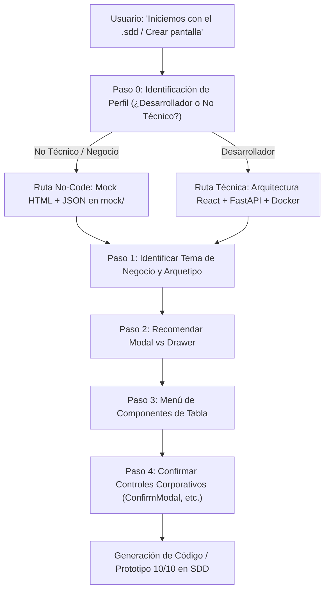

# Guía del Asistente Interactivo de Diseño de Páginas y Vistas
## Ecosistema Jolifoods — Metodología Spec-Driven Development (SDD)

Esta guía define el protocolo de conversación y asesoría arquitectónica que la **Inteligencia Artificial** o el **líder técnico** debe seguir cuando alguien solicita: *"vamos a crear una página"*, *"quiero un CRUD"*, *"diseñemos una pantalla de pedidos"* o *"necesito una tabla"*.

---

## 1. Regla de Oro: Asesorar Antes de Codificar

> **PRINCIPIO ARQUITECTÓNICO**:
> La Inteligencia Artificial **NO DEBE GENERAR CÓDIGO INMEDIATAMENTE**.
> Primero debe guiar a la persona a través de decisiones de experiencia de usuario (UX), ofreciendo recomendaciones técnicas fundamentadas y listas interactivas de componentes para que el usuario elija con facilidad.

---

## 2. Flujo de Diálogo Interactivo en 5 Pasos



---

### Paso 0: Identificación Inicial de Perfil (Mandatorio)

> **REGLA OBLIGATORIA**:
> La IA **NUNCA DEBE ASUMIR UN TEMA O DOMINIO POR DEFECTO** (ej. clima, ventas, pedidos) ni asumir el perfil técnico de la persona.
> Lo primero que debe consultar es el rol y el tema:

> *"¡Hola! Antes de iniciar, para adaptar las opciones y entregables a tu perfil:*
> *1. **¿Eres desarrollador de software o tienes un perfil no técnico / de negocio?***
>    - **Perfil No Técnico / Negocio**: Generamos prototipos visuales interactivos autónomos (HTML + Array JSON + .md de datos) listos para abrir con doble clic y entregar al equipo de desarrollo.
>    - **Perfil Desarrollador / Técnico**: Diseñamos contratos de API, esquemas Pydantic/DRF, componentes React 19 y arquitectura técnica de producción.
> *2. **¿Qué módulo o temática de negocio deseas construir?** (Ej. Ventas, Inventario, Clima, Cartera, Producción, etc.)"*

---

### Paso 1: Identificar el Arquetipo de Página
Una vez confirmado el perfil y el tema, la IA presenta las 4 opciones de diseño:

> *"Para estructurar tu módulo con el estándar Jolifoods, ¿qué tipo de pantalla deseas construir?"*

- **[A] Gestión de Entidad / CRUD Operativo (Recomendado)**: Listado con tabla, filtros tipo Excel, buscador en vivo y opciones para crear, editar, inspeccionar y dar de baja registros.
- **[B] Tablero de Control / Dashboard**: Métricas KPI superiores clickeables, gráficos interactivos, telemetría y bitácora de actividad reciente.
- **[C] Consulta Tabular / Reporte Analítico**: Tabla masiva con exportación a Excel, ordenamiento avanzado y filtros de auditoría.
- **[D] Asistente por Pasos (Wizard)**: Formulario secuencial (Paso 1, 2, 3) para procesos con muchas etapas.


---

### Paso 2: Recomendar la Experiencia de Creación y Edición (Modal vs Drawer)

La IA asesora a la persona sobre el contenedor ideal para capturar o editar datos:

> *"Para crear o editar registros en este módulo, ¿cómo prefieres la experiencia de usuario? Te comparto las dos opciones recomendadas:"*

```text
----------------------------------------------------------------------------------------------------
           OPCIONES DE EXPERIENCIA PARA FORMULARIOS DE CAPTURA / EDICIÓN
----------------------------------------------------------------------------------------------------
 (1) [Recomendado para 1 a 6 campos rápidos] Ventana Modal Centrada (ModalDialog)
     -> ¿Cuándo usarlo?: Operaciones breves, creación de usuarios simples, asignación de roles,
        cambio de estado o captura de datos puntuales.
     -> Ventajas: Diálogo centrado con backdrop blur que enfoca la atención del usuario en una sola tarea.
     -> Ref: .sdd/components/modal/modal_dialog.md

 (2) [Recomendado para formularios extensos o consultas activas] Panel Lateral Deslizable (Drawer)
     -> ¿Cuándo usarlo?: Entidades con muchos campos, auditorías con observaciones, o cuando el
        usuario necesita consultar datos de la tabla que está de fondo mientras llena el formulario.
     -> Ventajas: Slide-over lateral desde la derecha (sm: 400px, md: 600px, lg: 840px) con scroll
        independiente y pie con botones fijos (Estándar corporativo de alta densidad).
     -> Ref: .sdd/components/drawer/drawer.md

 (3) Pantalla Completa Dedicada (/nuevo y /editar/:id)
     -> ¿Cuándo usarlo?: Entidades complejas con más de 15 campos, múltiples pestañas y anexos documentales.
----------------------------------------------------------------------------------------------------
```

---

### Paso 3: Configurar los Componentes de la Tabla de Datos

Si la página incluye una tabla, la IA presenta el **Menú de Capacidades de Tabla** mostrando la lista preseleccionada:

> *"Para la tabla de datos, he preseleccionado el estándar empresarial Jolifoods. ¿Deseas activar todas estas capacidades o ajustar la selección?"*

```text
====================================================================================================
               COMPONENTES ACTIVABLES PARA LA TABLA DE DATOS (DATA TABLE)
====================================================================================================
 [x] (1) Filtros de Columna Tipo Excel (ChecklistPopover en cada <th>)
         -> Menú emergente con orden A-Z/Z-A, buscador interactivo, casillas con conteo (N) y botón 'Solo'.
 [x] (2) Paginador Superior Integrado en Toolbar (Pagination - Estándar bi/cartera)
         -> Ubicado ARRIBA de la tabla en toolbar superior, con resumen 'Mostrando X a Y de Z', elipsis de páginas y selector de filas (10, 20, 50, 100).
 [x] (3) Exportador Limpio a Excel (ExportExcelButton)
         -> Genera .xlsx con anchos auto-ajustados respetando estrictamente los filtros aplicados.
 [x] (4) Selector de Columnas Visibles (Columns3 Toggle)
         -> Menú desplegable para ocultar o mostrar columnas con persistencia en el navegador.
 [x] (5) Buscador Reactivo General
         -> Búsqueda en tiempo real con debounce y botón 'X' para limpiar.
 [x] (6) Botón 'Restablecer Filtros' (FilterX)
         -> Aparece automáticamente cuando hay filtros activos con contador (N) para limpiar en un clic.
 [x] (7) Cabeceras Fijas (Sticky Headers)
         -> Encabezados sticky que no se pierden al desplazarse verticalmente.
 [x] (8) Tarjetas de Resumen KPI Superiores (Estándar BI Cartera)
         -> 3 a 5 tarjetas superiores que actúan como filtros cruzados rápidos al hacer clic sobre ellas.
====================================================================================================
```

---

### Paso 4: Confirmar la Normativa de Controles Internos y Layout

La IA asegura la adherencia estricta a las normas corporativas Jolifoods:
1. **Layout Full-Width por Defecto (Cero Sidebar)**: Toda pantalla es de ancho completo a menos que el usuario pida explícitamente navegación lateral. El título de pantalla/módulo va siempre en el **TopHeader a la izquierda (`.topheader-left`)** junto a la marca Jolifoods (sin `<h1>` gigantes en el cuerpo).
2. **Paginación Superior y Card hasta Abajo (Estándar SDD)**: El paginador se ubica **ARRIBA DE LA TABLA** en la toolbar superior (`.table-header-toolbar.pagination-container`), y la card contenedora (`.main-card-container`) tiene `flex: 1` ocupando todo el espacio vertical disponible hasta el fondo del viewport visible.
3. **Estilo Corporativo en Controles de Formulario e Inputs**: Todo `<input>`, `<select>` y `<textarea>` dentro de modales o del Right Drawer debe implementar `.form-field` / `.drawer-form-field`, etiquetas en mayúsculas discretas (`.form-label`) y contenedor `.input-control` / `.drawer-input-control` con bordes, radios y halo de foco de acento corporativo (prohibido inputs nativos del navegador).
4. **Textos Contextuales en Botones**: El botón principal del footer en formularios debe reflejar la entidad (ej. *"Guardar Partido"*, *"Guardar Registro"*), prohibido textos fijos desfasados como *"Guardar Notas"*.
5. **Acciones Agrupadas Obligatorias**:
   - En Toolbar: Caja compacta de 28px (`.compact-action-box`) con iconos `+`, `FileSpreadsheet` verde y `RefreshCw`.
   - En Filas de Tabla: Contenedor unificado de 26px (`.row-actions-group`) con divisor de 1px (prohibido botones sueltos).
6. **Cero Texto Verde o Azul en Códigos/IDs**: Los identificadores y números usan fuente monoespaciada con color de texto neutro. El color verde queda reservado **exclusivamente para badges de estado positivo**.
7. **Cero Selects Planos**: Todos los catálogos o claves foráneas utilizarán `SelectFilter` (Searchable Select interactivo con soporte de teclado).
8. **Cero Confirmaciones Nativas**: Suspensiones, bajas o reinicios de clave utilizarán el `ConfirmModal` canónico Jolifoods con justificación de 10+ caracteres, portal y spinner.
9. **Cero Alertas Bloqueantes**: Mensajes de éxito o fallos de red se notificarán mediante `ToastNotification`.
10. **Respaldo ante Pantalla Vacía**: Si no hay datos o los filtros no coinciden, se desplegará el componente `EmptyState`.
11. **Paquete Modular No-Code en 4 Archivos**: Para prototipos en `mock/<modulo>/`, la entrega se divide estrictamente en 4 archivos independientes (`.html`, `.css`, `.js`, `datos_*.md`), prohibiendo archivos monolíticos.

---

## 3. Ejemplo Práctico de Diálogo Real

### Escenario: Usuario solicita crear un CRUD de Proveedores

**Usuario**:
> *"Vamos a crear una página para la gestión de proveedores con una tabla"*

**Respuesta obligatoria del Asistente**:
> *"¡Con gusto! Para estructurar la página de **Gestión de Proveedores** con los más altos estándares de Jolifoods, definamos la experiencia de usuario:
>
> 1. **Layout y Encabezado**:
>    - Full-Width (sin sidebar) con título 'Gestión de Proveedores' integrado en el TopHeader a la izquierda (`.topheader-left`) junto al logotipo.
>
> 2. **Formulario de Creación / Edición**:
>    - ¿Prefieres abrirlo en un **Panel Lateral Deslizable (Drawer)** (recomendado para inspeccionar y editar sin perder de vista la tabla) o en una **Ventana Modal Centrada**?
>
> 3. **Componentes para la Tabla de Proveedores**:
>    He preparado la configuración recomendada:
>    - [x] Toolbar compacta con acciones agrupadas en 28px (`+`, Excel verde, Refrescar)
>    - [x] Acciones por fila agrupadas en contenedor unificado de 26px (`.row-actions-group`)
>    - [x] Códigos y NITs en tipografía monoespaciada neutra (sin textos verdes)
>    - [x] Filtros por columna tipo Excel (`ChecklistPopover` en NIT, Ciudad, Estado)
>    - [x] Selector de columnas visibles (`Columns3`)
>    - [x] Paginador server-side (`Pagination` 10, 25, 50, 100)
>    - [x] 3 KPIs superiores (Total Proveedores, Activos, Bloqueados) como filtros rápidos
>    - [x] Diálogo corporativo (`ConfirmModal`) con justificación obligatoria para dar de baja proveedores
>
> ¿Te parece bien esta arquitectura o deseas modificar algún elemento antes de generar la especificación?"*
