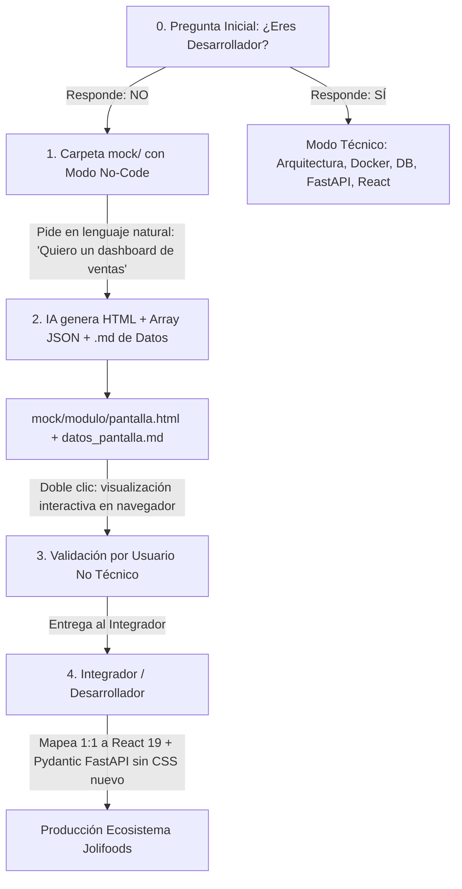

# Metodología de Mocks Autónomos para Usuarios No Técnicos y el Integrador de Desarrollo (SDD)

Este documento define el estándar operativo mediante el cual **cualquier persona de la organización (sin conocimientos de programación)** puede solicitar o entregar un mockup funcional y visual a un **integrador / desarrollador de software**, garantizando que el sistema **SDD (Spec-Driven Development)** reutilice 100% los estilos y componentes existentes sin inventar CSS nuevo ni duplicar código.

---

## 1. El Problema Común y la Solución SDD

| Enfoque Tradicional (Caótico) | Enfoque SDD (Estandarizado y Autónomo) |
| :--- | :--- |
| El usuario dibuja en papel, manda un Excel o una captura de Figma desconectada del sistema. | La persona le describe a la IA en lenguaje natural lo que necesita ("un dashboard de ventas"). |
| El programador interpreta libremente la pantalla y escribe CSS nuevo desde cero. | La IA genera un archivo **HTML autónomo (`mockup_ejemplo.html`)** usando exclusivamente las clases del Design System SDD. |
| Inconsistencias visuales, botones de diferente tamaño, fuentes distintas y retrabajo constante. | El usuario hace doble clic al archivo HTML y lo ve inmediatamente en su navegador (Edge/Chrome) sin instalar nada. |
| El sistema termina con componentes duplicados y estilos redundantes. | El integrador recibe el HTML y mapea cada bloque 1:1 a los componentes React/TypeScript ya existentes en `.sdd/components/`. |

---

## 2. Flujo de Trabajo en 4 Pasos: De la Idea a la Producción



### Paso 0: Identificación Inicial de Perfil
Antes de iniciar cualquier acción, la IA consulta:
> *"¿Eres desarrollador de software o tienes un perfil no técnico / de negocio?"*
> - Si **NO es desarrollador**: Se activa el **Modo Prototipado No-Code** y todo se organiza dentro de la carpeta `mock/`.
> - Si **SÍ es desarrollador**: Se procede con el diseño de arquitectura, Docker, PostgreSQL, esquemas FastAPI y componentes React.

### Paso 1: Solicitud en Lenguaje Natural (Usuario No Técnico)
La persona no necesita saber qué es un `div`, un `hook` ni una `API`. Solo debe indicar:
1. **El objetivo de la pantalla**: (Ej. *"Quiero un dashboard de ventas para monitorear facturas del día"*).
2. **Los indicadores clave (KPIs)**: (Ej. *"Ventas de Hoy, Meta del Mes, Facturas por Cobrar y Cartera Vencida"*).
3. **Las acciones y filtros**: (Ej. *"Poder hacer clic en un KPI para filtrar la tabla, buscador de clientes y botón para descargar en Excel"*).

### Paso 2: Generación del Paquete No-Code Modular en la Carpeta `mock/<nombre_modulo>/`
La IA genera obligatoriamente **4 archivos limpios e independientes más su subcarpeta de assets locales (Cero HTML monolítico)**:

1. **La Estructura de Marcado (`[pantalla].html`)**:
   - Estructura HTML limpia y semántica, que enlaza `<link rel="stylesheet" href="./[pantalla].css">`, `<script src="./[pantalla].js"></script>` y ``.
   - **Apertura inmediata con doble clic**: Abre directamente en Edge o Chrome sin necesi    - Contiene el esqueleto visual de la Top Navbar, KPIs, la card contenedora (`.main-card-container`) con toolbar superior, tabla interna con scroll y contenedores para el Drawer lateral y el ConfirmModal.

2. **La Hoja de Estilos del Módulo (`[pantalla].css`)**:
   - Importa o define las variables canónicas de `variables.css`.
   - Implementa el layout donde la card principal (`.main-card-container`) ocupa **todo el espacio vertical disponible hasta abajo de la pantalla** (`flex: 1`), con tabla interna con scroll independiente (`overflow: auto`).
   - Define la toolbar superior (`.table-header-toolbar.pagination-container`) donde el paginador se ubica **ARRIBA DE LA TABLA**, integrado con el buscador y el selector de filas.
   - Incluye los estilos corporativos obligatorios para controles de formulario e inputs dentro del Drawer (`.drawer-form-field`, `.drawer-field-label`, `.drawer-input-control`, `.drawer-field-input`).

3. **La Lógica Interactiva Desacoplada (`[pantalla].js`)**:
   - Aloja el dataset inicial de 20 a 30 registros (`const MOCK_DATA = [...]`) en memoria.
   - Implementa la renderización dinámica de la tabla (`renderTable()`).
   - Gobierna la paginación superior en tiempo real, el buscador con debounce, los filtros tipo Excel `ChecklistPopover`, el redimensionamiento de columnas, la apertura del Right Drawer y el conmutador dual de tema (Día/Noche).

4. **El Documento de Especificación de Datos (`datos_[pantalla].md`)**:
   - Basado en [plantilla_datos_necesarios.md](../mock/plantilla_datos_necesarios.md).
   - Especifica la lista de campos que el backend debe entregar en su JSON (ej. `id`, `codigo`, `total`, `estado`).
   - Define los parámetros de filtro (búsqueda, fechas, paginación, ordenamiento) y las operaciones permitidas.

5. **Directorio Local de Identidad de Marca (`assets/`)**:
   - Subcarpeta local que aloja las copias de los logotipos vectoriales e isotipos de Jolifoods (`Jolifoods.svg`, `Joli.svg`, `logoJoli.png`) extraídos desde `.sdd/assets/`.
   - Garantiza que la pantalla sea 100% portable y autónoma en modo offline, permitiendo compartir la carpeta del prototipo con cualquier persona de la empresa sin que se rompan las imágenes ni el favicon.

### Paso 3: Validación por el Usuario No Técnico
El solicitante abre el archivo `.html` en su navegador web:
- Verifica los títulos, colores, disposición de columnas e iconos.
- Prueba el buscador y el botón de alternar tema (Oscuro / Claro).
- Si requiere ajustes, le pide a la IA: *"Agrega una columna de Teléfono en el array JSON y muéstrala en la tabla"*.
- Una vez conforme, entrega la carpeta `mock/<nombre_modulo>/` al integrador.

### Paso 4: Implementación del Integrador (Reutilización Estricta)
El programador no crea CSS nuevo:
1. Copia el arreglo `const MOCK_DATA` como fixture de datos de prueba.
2. Lee el archivo `datos_[pantalla].md` para crear los modelos Pydantic y consultas Django con `.values()`.
3. Mapea cada bloque visual a los componentes React existentes usando la **Tabla de Equivalencias SDD**:

---

## 3. Matriz de Equivalencias: Del HTML del Mockup al Componente React

Cuando el integrador abre el mockup HTML, cada sección corresponde unívocamente a un componente React ya documentado en `.sdd/`:

| Bloque en el Mockup HTML | Clase CSS SDD Embebible | Componente React a Reutilizar | Documentación SDD de Referencia |
| :--- | :--- | :--- | :--- |
| **Título en TopHeader (Lado Izquierdo)** | `<div class="topheader-left">` con `.topheader-title-box` | `<TopHeader title="..." badge="..." />` *(Prohibido títulos h1 en cuerpo)* | [navbar.md](../components/layout/navbar.md) |
| **Layout Full-Width (Sin Sidebar)** | Layout sin aside lateral | `<MainLayout fullWidth={true}>` *(Sidebar solo si usuario lo pide)* | [sidebar.md](../components/layout/sidebar.md) |
| **Panel Lateral Derecho (Drawer)** | `<aside class="joli-drawer-container">` | `<RightDrawer />` *(Prohibido modales centrados)* | [drawer.md](../components/drawer/drawer.md) |
| **Acciones Toolbar de Tabla** | `<div class="compact-action-box">` | `<IconActionGroup />` *(Botones de solo icono, sin texto)* | [icon_action_group.md](../components/button/icon_action_group.md) |
| **Acciones por Fila Agrupadas** | `<div class="row-actions-group">` | `<RowActionGroup />` *(Botones agrupados con divisor de 1px)* | [icon_action_group.md](../components/button/icon_action_group.md) |
| **Filtros Superiores Expandibles** | `<div class="expandable-filter-group">` | `<ExpandableFilterGroup />` | [expandable_filter_group.md](../components/dropdown/expandable_filter_group.md) |
| **Switcher de Vistas (Pill)** | `<div class="view-switcher">` | `<ViewSwitcher />` | [button.md](../components/button/button.md) |
| **Contenedor de Métricas** | `<div class="joli-kpi-row">` | `<div className="joli-kpi-row">` | [kpi_cards.md](../components/kpi/kpi_cards.md) |
| **Tarjeta de Métrica (KPI)** | `<div class="joli-kpi-card">` | `<KpiCard />` *(Content + Icon Box)* | [kpi_cards.md](../components/kpi/kpi_cards.md) |
| **Buscador de Texto** | `<div class="toolbar-search-box">` | `<SearchInput />` | [input_field.md](../components/login/input_field.md) |
| **Tabla con Scroll y Sombra** | `<div class="joli-datatable-wrapper">` | `<DataTableWrapper />` | [data_table.md](../components/data_table/data_table.md) |
| **Estados / Badges Pill** | `<span class="badge-pill-joli">` | `<BadgeStatus variant="..." />` *(Verde solo para óptimo/positivo)* | [badge_status.md](../components/badge/badge_status.md) |
| **Paginador Superior en Toolbar** | `<div class="table-header-toolbar pagination-container">` | `<Pagination placement="top" />` *(Arriba de la tabla, con buscador y selector)* | [pagination.md](../components/pagination/pagination.md) |
| **Card Contenedora hasta Abajo** | `<div class="main-card-container">` | `<div className="main-card-container">` *(`flex: 1` hasta abajo del viewport)* | [data_table.md](../components/data_table/data_table.md) |
| **Inputs y Controles en Drawer** | `<div class="drawer-form-field">` con `.drawer-input-control` | `<FormField>`, `<Input>` corporativo *(Prohibido inputs nativos sin estilo)* | [drawer.md](../components/drawer/drawer.md) |
| **Confirmación Crítica** | Estructura Jolifoods ConfirmModal | `<ConfirmModal type="danger" />` *(Prohibido modal Bootstrap genérico)* | [confirm_modal.md](../components/modal/confirm_modal.md) |érico)* | [confirm_modal.md](../components/modal/confirm_modal.md) |


---

## 4. Ejemplo Práctico Funcional Disponible en el Repositorio

Para inspeccionar o utilizar de inmediato este flujo, se ha provisto un ejemplo completo en:
- [mockup_dashboard_ventas_ejemplo.html](pages/dashboard/mockup_dashboard_ventas_ejemplo.html)

### ¿Qué contiene este ejemplo?
1. **4 Tarjetas KPI interactivas**:
   - *Ventas Hoy ($18,450,000)*: Con estado activo (`.active-filter`) que simula el filtrado cruzado.
   - *Meta del Mes ($240,000,000)*: Con barra de progreso integrada al 76%.
   - *Por Cobrar ($42,120,000)*: Con indicador de advertencia amarillo.
   - *Cartera Vencida ($6,850,000)*: Con indicador de alerta rojo y conteo de clientes.
2. **Barra de Herramientas**: Buscador en vivo, selector de sucursal con icono de búsqueda y botón exportador a Excel.
3. **Tabla Corporativa**:
   - Cabeceras fijas (`sticky-top`) con iconos de filtro estilo Excel.
   - Filas alternadas (`hover`) y badges corporativos Jolifoods.
   - Menú de acciones (Ver detalle, Descargar PDF).
4. **Selector de Tema**: Botón superior derecho para alternar instantáneamente entre **Modo Oscuro** y **Modo Claro**.

---

## 5. Instrucciones para la Persona No Técnica (Cómo pedir un Mock a la IA)

Cualquier persona puede copiar y pegar la siguiente plantilla de prompt para solicitarle a la IA la creación del mock:

```text
"Hola, no sé programar, pero necesito presentarle un mockup de una pantalla al desarrollador.
Quiero que me generes un archivo HTML autónomo basado en las especificaciones del SDD.

La pantalla es: [Nombre de la Pantalla, ej. Dashboard de Producción / Vista de Inventario]
Necesito que tenga:
- Métricas principales: [Métrica 1, Métrica 2, Métrica 3]
- Filtros o controles: [Buscador, selector de fecha, botón de exportar]
- Tabla o listado: [Columnas que debe mostrar la tabla]
- Estados visuales: [Ej. Activo en verde, Pendiente en amarillo, Rechazado en rojo]

Usa la plantilla oficial de .sdd/components/mockup_template.html para que pueda abrirlo
con doble clic en mi navegador y entregárselo al programador."
```

---

## 6. Instrucciones para el Integrador / Desarrollador (Cómo implementar el Mock)

Cuando recibas el archivo `.html`:
1. **Abre el archivo en el navegador** para entender el layout y los flujos que el usuario aprobó.
2. **Abre el código HTML**: Observa los nombres de las clases CSS utilizadas (`.joli-kpi-card`, `.joli-table`, etc.).
3. **No escribas CSS nuevo**: Importa los componentes React correspondientes desde tu librería interna o desde los templates en `.sdd/components/`.
4. **Conecta los datos dinámicos**:
   - Las tarjetas KPI se conectan a los endpoints FastAPI `/fast/metricas/`.
   - La tabla se conecta al endpoint paginado con filtros server-side.
5. **Reemplaza cualquier elemento nativo**:
   - Asegúrate de que las confirmaciones usen `ConfirmModal`.
   - Que los selects usen `SelectFilter` con búsqueda integrada.
   - Que las notificaciones usen `ToastNotification`.

---

## 7. Checklist Anti-Olvidos de Negocio (Blindaje No-Code)

Para asegurar que no quede ningún cabo suelto antes de iniciar el desarrollo en código, el prototipo debe cumplir este checklist de 8 puntos:

1. **[ ] Layout Full-Width y Título en TopHeader**: La pantalla aprovecha el ancho completo (sin sidebar de navegación a menos que el usuario lo solicite explícitamente). El título del módulo se ubica en el TopHeader a la izquierda (`.topheader-left`) junto al logotipo de Jolifoods, eliminando encabezados gigantes innecesarios en el cuerpo.
2. **[ ] Acciones Agrupadas**: Toolbar compacta de 28px (`.compact-action-box`) y botones de fila agrupados en contenedor unificado de 26px (`.row-actions-group`) con divisor de 1px (prohibido botones sueltos).
3. **[ ] Tipografía Neutra en Códigos/IDs**: Los identificadores y números usan fuente monoespaciada con color de texto neutro. Prohibido textos verdes en códigos (el verde se reserva únicamente para badges de estado positivo).
4. **[ ] Pegado Directo desde Excel**: Si el solicitante tiene una tabla en Excel, permitir copiar y pegar las filas en el chat para transformarlas a JSON sin obligar a escribir sintaxis de programación.
5. **[ ] Estado Vacío Diseñado (Empty State)**: La pantalla debe mostrar cómo se ve cuando no hay registros aún o la búsqueda no arroja resultados, con mensaje claro e icono ilustrado.
6. **[ ] Estado de Espera (Skeleton Loader)**: Simular la animación de carga para que el usuario entienda qué se mostrará mientras el servidor responde.
7. **[ ] Matriz de Permisos por Rol**: Dejar explícito en `datos_[pantalla].md` qué columnas o botones ve un administrador vs un operario o vendedor.
8. **[ ] Acciones Destructivas con Justificación Auditada**: Los botones de anulación o eliminación deben abrir el `ConfirmModal` canónico Jolifoods con textarea a ancho completo 100% (`.joli-modal-textarea`), contador dinámico (`0 / 10 mín.`) y botón de confirmación condicionado y deshabilitado hasta ingresar al menos 10 caracteres válidos.
9. **[ ] Validación de Campos**: Formulario de adición de prueba en Right Drawer con asteriscos rojos `*` en los campos obligatorios.
10. **[ ] Formatos Locales Claros**: Cifras en pesos colombianos (`$ 1.487.500`), fechas legibles (`30 Sep 2026, 09:15 AM`) y porcentajes (`76,8%`).
11. **[ ] Definición de Dispositivo**: Aclarar si se usará en computadores de escritorio o en tablets/celulares de campo o bodega para adaptar el layout.
12. **[ ] Paginador Superior en Toolbar y Card hasta Abajo**: La paginación debe estar ubicada en la toolbar superior de la tabla (`.table-header-toolbar.pagination-container`), y la card principal (`.main-card-container`) debe expandirse hasta la parte inferior del viewport visible (`flex: 1`).
13. **[ ] Controles de Formulario e Inputs Estilizados**: Todo `<input>`, `<select>` y `<textarea>` dentro de modales o del Right Drawer debe implementar `.form-field` / `.drawer-form-field` con bordes, radios y halo de foco de acento corporativo (prohibido inputs nativos del navegador).
14. **[ ] Textos de Botones Contextuales**: El botón principal del footer en formularios debe decir exactamente qué guarda (ej. *"Guardar Partido"*, *"Guardar Registro"*), prohibido textos fijos desfasados como *"Guardar Notas"*.
15. **[ ] Paquete Modular de 4 Archivos**: El mock debe entregarse estrictamente en 4 archivos independientes (`.html`, `.css`, `.js`, `datos_*.md`), con cero código monolítico.
16. **[ ] Identidad de Marca y Carpeta assets/ Local**: La subcarpeta `assets/` debe acompañar al mock conteniendo los logos oficiales (`Jolifoods.svg`, `Joli.svg`, `logoJoli.png`) tomados desde `.sdd/assets/`, y el TopHeader debe referenciar relativamente `` con favicon, garantizando portabilidad offline 100% libre de imágenes rotas.
17. **[ ] Cero Testing y Cero Pruebas Automáticas**: En el **Modo Mock**, queda terminantemente **prohibido e innecesario ejecutar o requerir pruebas automáticas, Pytest, Playwright, suites E2E o validaciones con `validate_endpoints.py`**. Por su naturaleza, un mock es exclusivamente una simulación visual e interactiva sin backend real ni base de datos conectada. El testing se reserva para cuando el integrador construya el código en `frontend/` y `backend/`.


