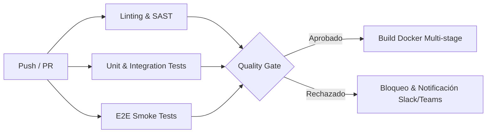

# Protocolo de DevOps, CI/CD y Puertas de Calidad (Quality Gates)
## Ecosistema Corporativo Jolifoods / Greenyard — Metodología SDD

Este protocolo formaliza las reglas obligatorias de control de versiones, validación previa al commit, detección de fugas de secretos y pipelines de integración y despliegue continuo (**CI/CD**).

---

## 1. Pre-commit Hooks Obligatorios (Higiene Local de Código)

Queda prohibido realizar commits que no hayan superado la suite de validación estática local. En cada repositorio hijo de `.sdd` debe configurarse `.pre-commit-config.yaml` con las siguientes herramientas:

### 1.1. Herramientas Mandatorias
1. **Ruff / Black (Python)**:
   - Formateo estricto con longitud máxima de línea de 100 caracteres.
   - Detección de imports no utilizados y variables muertas.
2. **ESLint + Prettier (Frontend React / TypeScript)**:
   - Prohibición de tipos `any` implícitos.
   - Forzado de imports canónicos desde `@components/` o rutas relativas normalizadas.
3. **Escaneo Antifugas de Secretos (`detect-secrets` / `trufflehog`)**:
   - Bloqueo instantáneo ante presencia de tokens JWT, claves privadas RSA/SSH, cadenas de conexión con contraseñas en plano o API keys de terceros.

### 1.2. Configuración Canónica `.pre-commit-config.yaml`
```yaml
repos:
  - repo: https://github.com/astral-sh/ruff-pre-commit
    rev: v0.4.4
    hooks:
      - id: ruff
        args: [--fix]
      - id: ruff-format

  - repo: https://github.com/pre-commit/pre-commit-hooks
    rev: v4.6.0
    hooks:
      - id: check-yaml
      - id: check-json
      - id: end-of-file-fixer
      - id: trailing-whitespace
      - id: check-added-large-files
        args: ['--maxkb=2048']

  - repo: https://github.com/Yelp/detect-secrets
    rev: v1.5.0
    hooks:
      - id: detect-secrets
        args: ['--baseline', '.secrets.baseline']
```

---

## 2. Estrategia de Ramas y Git Flow Corporativo

1. **Rama `main` (Producción)**:
   - Solo recibe código vía Pull Request/Merge Request aprobado desde `develop` o `hotfix/*`.
   - Protección activa: Mínimo 1 aprobación humana obligatoria + paso exitoso del 100% de tests.
   - `git push --force` deshabilitado de manera irrevocable.
2. **Rama `develop` (Staging / Pruebas Integradas)**:
   - Integración continua de features completadas.
3. **Ramas de Funcionalidad (`feature/nombre-modulo`)**:
   - Nacen desde `develop`. Nomenclatura kebab-case: `feature/facial-scanner`, `feature/kpi-dashboard`.
4. **Ramas de Corrección Inmediata (`hotfix/incidente-id`)**:
   - Nacen directamente de `main` y se fusionan en `main` y `develop` simultáneamente.

---

## 3. Convención de Commits y Versionado Semántico (SemVer)

Todo commit debe seguir el estándar **Conventional Commits**:
- `feat(modulo):` Nueva funcionalidad.
- `fix(modulo):` Corrección de un fallo o bug.
- `perf(modulo):` Mejora de rendimiento (ej. erradicación de N+1).
- `security(modulo):` Hardening o parche de vulnerabilidad OWASP.
- `refactor(modulo):` Reestructuración interna sin alterar comportamiento externo.
- `test(modulo):` Inclusión o ajuste de suites de pruebas E2E o unitarias.

### Versionado Semántico (`vX.Y.Z`):
- **MAJOR (X)**: Cambios que rompen compatibilidad hacia atrás (Breaking changes en API o base de datos).
- **MINOR (Y)**: Nuevas funciones retrocompatibles (nuevos componentes, nuevos endpoints).
- **PATCH (Z)**: Correcciones de errores y parches de seguridad.

---

## 4. Quality Gates en CI/CD Pipeline (GitHub Actions / GitLab CI)

El pipeline de integración continua debe ejecutar las siguientes fases en paralelo:



### Reglas Inflexibles de Rechazo:
1. **Cobertura de Código**: Si la cobertura en la capa de servicios o negocio cae por debajo del **80%**.
2. **Vulnerabilidades SAST**: Detección de cualquier vulnerabilidad de severidad Alta o Crítica en dependencias (`pip-audit` / `npm audit`).
3. **Fallas E2E**: Fallo en al menos una prueba de humo Playwright (Login, navegación básica o persistencia de sesión).
