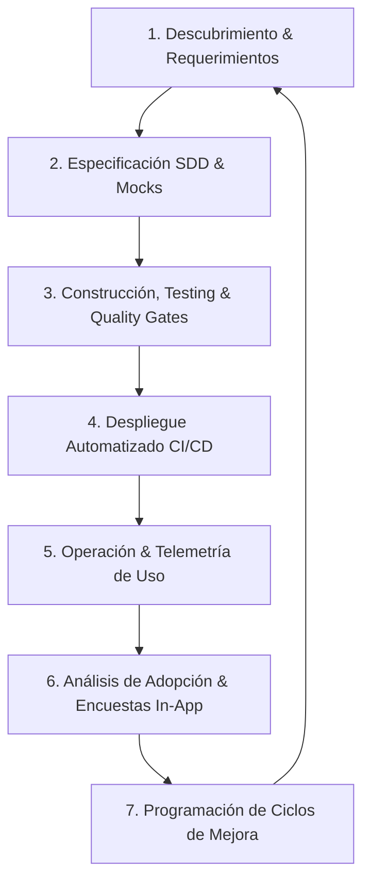

# Protocolo del Ciclo de Vida del Software (SDLC) y Mejora Continua
## Ecosistema Corporativo Jolifoods / Greenyard — Metodología SDD

Este protocolo rige las **fases del ciclo de vida de cualquier programa informático** dentro de la organización, guiando tanto a ingenieros técnicos como a perfiles Senior y Tech Leads a orientar permanentemente el desarrollo hacia la **mejora continua basada en datos de uso real**.

---

## 1. Filosofía de Ingeniería: El Ciclo de Vida Guiado por Adopción (Data-Driven SDLC)

Ningún sistema de software se considera "terminado" tras el primer despliegue. El software es un organismo vivo que atraviesa **7 fases secuenciales e iterativas**:



---

## 2. Las 7 Fases del Ciclo de Vida de un Programa Informático

### Fase 1: Descubrimiento, Alineación de Negocio e Ideación (Discovery)
- **Objetivo**: Comprender el dolor operativo del usuario sin asumir soluciones técnicas a ciegas.
- **Entregables**: Cuestionario de negocio (Paso 0 del SDD), definición de problemas clave y valor esperado.

### Fase 2: Especificación Formal y Prototipado Interactivo (Spec & Prototyping)
- **Objetivo**: Diseñar los contratos de datos (OpenAPI/Pydantic), modelos relacionales y prototipos visuales interactivos (`mock/`).
- **Validación**: Aprobación de las pantallas por los usuarios operativos antes de codificar la lógica backend.

### Fase 3: Construcción, Hardening y Blindaje de Calidad (Development & QA)
- **Objetivo**: Implementación técnica bajo el estándar SDD (Django + FastAPI ASGI, componentes UI auditados, aislamiento en `.venv`).
- **Control de Calidad**: Validación obligatoria de los protocolos:
  - Protocolo 00 (OWASP 35/35, Anti-N+1, 100% Horizontal).
  - Protocolo 11 (Pruebas unitarias, endpoints con `validate_endpoints.py`, cobertura > 80%).

### Fase 4: Despliegue y Liberación Progresiva (Deployment & Release)
- **Objetivo**: Puesta en producción automatizada mediante contenedores Docker multi-etapa y migraciones *Zero-Downtime* (Protocolo 08).
- **Estrategia**: Liberación por grupos de usuarios (Canary o Blue/Green) con monitoreo en tiempo real.

### Fase 5: Operación, Observabilidad y Telemetría de Uso (Telemetry & Operations)
- **Objetivo**: Medir la estabilidad y el comportamiento de la plataforma en producción.
- **Herramientas**: Healthchecks profundo vs superficial, `X-Correlation-ID` (Protocolo 07) y **Dashboard de Uso de Plataforma**.

### Fase 6: Análisis de Adopción y Escucha Activa al Usuario (User Feedback & Usage Analytics)
- **Objetivo**: Descubrir qué módulos se usan masivamente y cuáles han sido abandonados o generan confusión.
- **Mecanismos**:
  1. **Telemetría de Eventos**: Frecuencia de clics, accesos por módulo, generación de reportes y descargas Excel.
  2. **Micro-Encuestas In-App**: Preguntar directamente en la interfaz:
     - *"¿Cuál es la función que más utilizas en tu jornada?"*
     - *"¿Qué proceso te toma demasiado tiempo o resulta confuso?"*
     - *"¿Qué botón o funcionalidad nueva necesitas para agilizar tu trabajo?"*

### Fase 7: Planificación y Programación de Ciclos de Mejora (Continuous Improvement)
- **Objetivo**: Convertir la retroalimentación y la telemetría en sprints de desarrollo evolutivo.
- **Priorización RICE**:
  $$\text{Score} = \frac{\text{Reach (Alcance)} \times \text{Impact (Impacto)} \times \text{Confidence (Confianza)}}{\text{Effort (Esfuerzo)}}$$

---

## 3. Matriz de Roles: Responsabilidades del Perfil Técnico vs. Perfil Senior

| Dimensión | Rol Técnico (Junior / Mid Developer) | Rol Senior / Tech Lead / Arquitecto |
| :--- | :--- | :--- |
| **Monitoreo de Uso** | Revisa errores 4xx/5xx y endpoints con alta latencia reportados por el Dashboard. | Analiza patrones de adopción (DAU/MAU) y módulos con abandono para proponer rediseños de UX. |
| **Gestión de Feedback** | Clasifica sugerencias de usuarios y resuelve bugs o fricciones reportadas en encuestas. | Diseña las preguntas estratégicas de las micro-encuestas y programa los ciclos de mejora en el roadmap. |
| **Ciclos de Mejora** | Ejecuta refactorizaciones de código, acelera consultas con `.select_related()` y optimiza componentes. | Evalúa el retorno de inversión técnica, reduce deuda técnica estructural y coordina con stakeholders. |
| **Gobernanza SDD** | Aplica los componentes y protocolos canónicos sin reinventar la rueda ni crear CSS aislado. | Audita la conformidad del equipo, actualiza los blueprints del SDD e impulsa la cultura de calidad cero-bugs. |

---

## 4. Estándar de Micro-Encuestas In-App para Detección de Mejoras

Toda plataforma del ecosistema que active el módulo de analítica de producto debe desplegar el componente de captura de feedback no invasivo:

```typescript
export interface UserFeedbackSurvey {
  userId: string;
  userRole: string;
  mostUsedFeature: string;      // ej. "Filtros tipo Excel en Cartera"
  leastUsedFeature?: string;    // ej. "Visor PDF"
  painPoints: string;           // ej. "La carga de evidencias tarda en redes móviles lentas"
  suggestedImprovement: string; // ej. "Permitir comprimir fotos antes de subirlas"
  satisfactionScore: number;    // 1 a 5 estrellas
  submittedAtIso: string;
}
```

---

## 5. Calendario y Cadencia de los Ciclos de Mejora

1. **Revisión Mensual de Telemetría**: El primer lunes de cada mes, el equipo técnico extrae las métricas del Dashboard de Uso.
2. **Depuración de Funcionalidades Muertas**: Toda opción o pantalla que tenga menos del **2% de uso en 90 días** debe evaluarse para rediseño, simplificación o eliminación (reducir superficie de mantenimiento).
3. **Sprint de Optimización y Ergonomía**: Al menos **1 de cada 4 sprints** debe reservarse exclusivamente para mejoras de usabilidad, ergonomía y rendimiento solicitadas por los usuarios reales.
