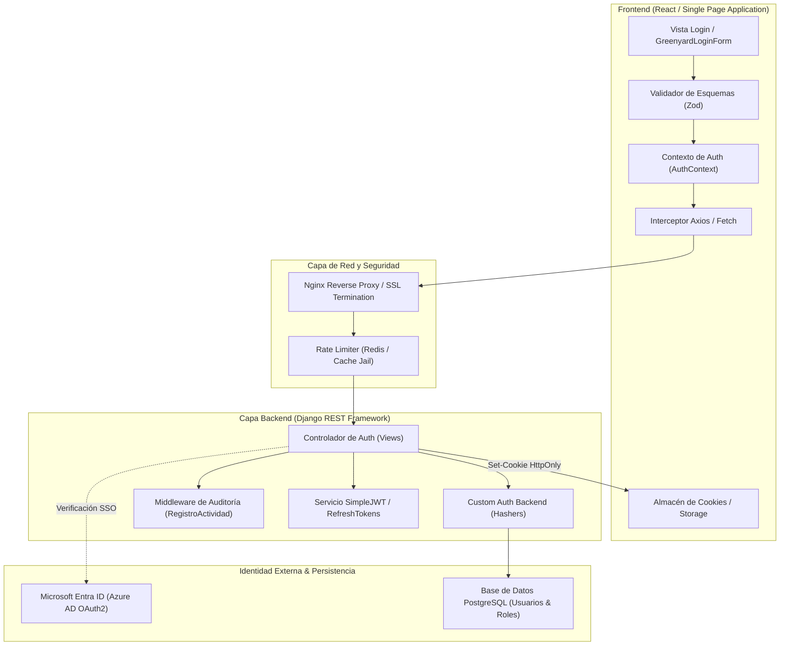
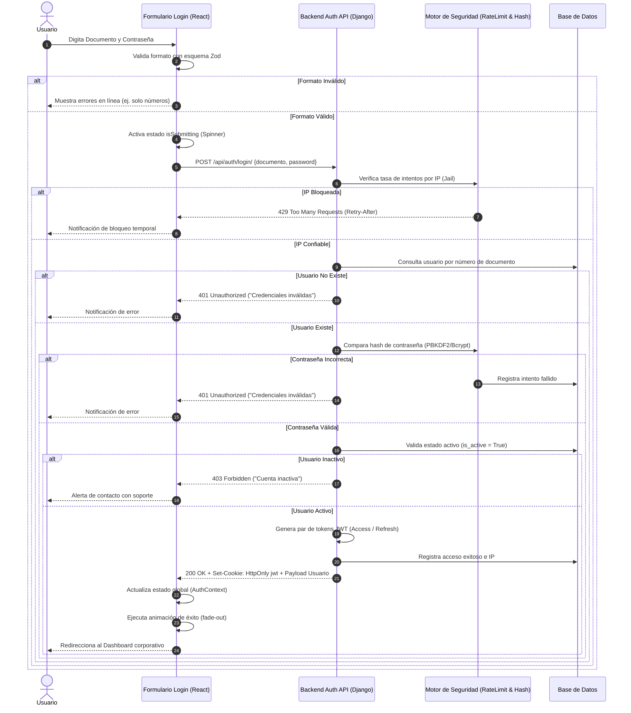
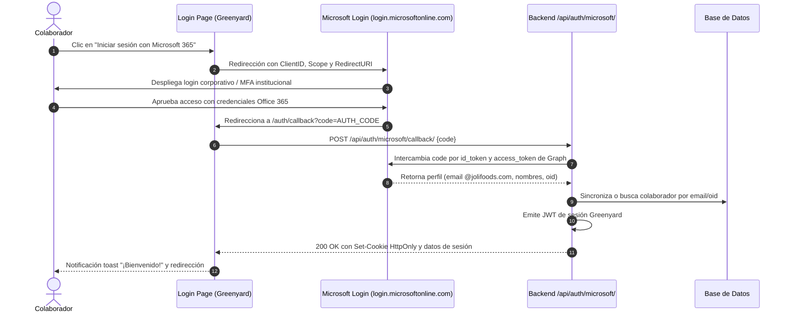
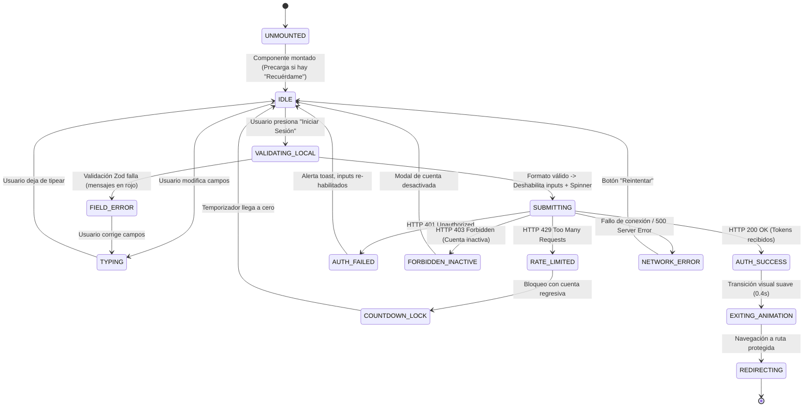

# 02. Arquitectura de Sistema y Máquinas de Estado
## Módulo de Login / Autenticación — SDD Greenyard (`GY-SPEC-AUTH-001`)

---

## 1. Topología Arquitectónica del Sistema

El sistema de autenticación de Greenyard opera bajo un modelo de desacoplamiento entre el cliente frontend (SPA en React / Vite) y la capa de servicios backend (Django REST Framework / Python) conectada a la infraestructura corporativa de identidad (Microsoft Azure AD / Entra ID).

---

## 2. Diagramas de Secuencia de Autenticación

### 2.1. Flujo Canónico con Credenciales (Cédula + Contraseña)

---

### 2.2. Flujo Institucional Single Sign-On (Microsoft 365 Azure AD)

---

## 3. Máquina de Estados Finitos (FSM) de la Interfaz

---

## 4. Ciclo de Vida del Token de Sesión

1. **Emisión**: Se genera un Access Token (vida útil: 1 hora) y un Refresh Token (vida útil: 24 horas a 7 días).
2. **Transporte Seguro**: El Access Token se envía preferentemente en una cookie `HttpOnly`, `Secure`, `SameSite=Lax`.
3. **Validación en Vuelo**: En cada petición entrante, el middleware de backend valida la firma criptográfica RSA/HMAC y verifica que el usuario no haya sido revocado en la base de datos.
4. **Rotación Silenciosa (Silent Refresh)**: Si el access token expira, el interceptor del cliente dispara una petición a `/api/auth/refresh/` para obtener un nuevo par sin interrumpir al usuario.
5. **Revocación**: Al presionar "Cerrar Sesión", el Refresh Token se añade a una lista negra (Blacklist) en la base de datos y la cookie del navegador es eliminada (`Max-Age=0`).
