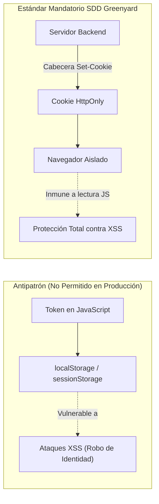

# 05. Seguridad, Auditoría y Hardening
## Módulo de Login / Autenticación — SDD Greenyard (`GY-SPEC-AUTH-001`)

Este documento especifica las defensas, políticas criptográficas y mecanismos de trazabilidad requeridos para blindar el inicio de sesión contra ataques informáticos en conformidad con las normas **OWASP Top 10** y las políticas de ciberseguridad de Greenyard.

---

## 1. Matriz de Mitigación OWASP Top 10

| Vector de Amenaza | Riesgo Asociado | Contramedida Obligatoria SDD |
| :--- | :--- | :--- |
| **A01: Broken Access Control** | Bypass de rutas protegidas sin sesión válida o escalamiento de privilegios. | - Middleware de backend valida firma criptográfica y estado activo en cada llamada.<br>- Guards de frontend (`ProtectedRoute`) impiden renderizar vistas antes de validar sesión. |
| **A02: Cryptographic Failures** | Exposición de credenciales en tránsito o algoritmos de hashing obsoletos (MD5/SHA1). | - Obligatoriedad de TLS 1.3 con HSTS habilitado.<br>- Hashing con PBKDF2-SHA256 (mínimo 600,000 rondas) o Argon2id con salt criptográfico individual. |
| **A03: Injection (SQL / NoSQL)** | Inyección SQL a través del campo `documento` o parámetros de formulario. | - Consultas parametrizadas obligatorias a través de ORM (Django ORM / SQLAlchemy).<br>- Sanitización estricta por regex: solo dígitos `^[0-9]+$` rechazando caracteres como `'`, `--`, `;`. |
| **A07: Identification & Auth Failures** | Ataques de fuerza bruta, ataques de diccionario y credential stuffing. | - Rate limiting escalonado por IP y por cuenta objetivo.<br>- Respuestas unificadas de error para no revelar la existencia de usuarios ("Credenciales inválidas"). |
| **A08: Software & Data Integrity** | Falsificación o manipulación de tokens de sesión JWT. | - Firma HMAC-SHA256 o RSA con rotación de claves secretas.<br>- Inclusión de claims `exp`, `iat`, `jti` y validación de expiración estricta. |

---

## 2. Política de Transporte y Almacenamiento Seguro de Sesiones



### Directivas de la Cookie de Autenticación (`Set-Cookie`)
- **`HttpOnly`**: Impide que scripts del navegador (document.cookie) puedan leer o transmitir el token.
- **`Secure`**: La cookie solo se transmite a través de conexiones cifradas HTTPS (habilitada en todo entorno excepto desarrollo local).
- **`SameSite=Lax`**: Evita que la cookie sea adjuntada en solicitudes maliciosas originadas desde dominios de terceros (mitigación CSRF).
- **`Path=/`**: Define el ámbito de validez de la sesión dentro de la plataforma.
- **`Max-Age=86400`**: Tiempo de caducidad fijado en 24 horas (ajustable por variable de entorno).

---

## 3. Algoritmo de Rate Limiting Escalonado (Protección Fuerza Bruta)

El backend debe implementar un controlador de tasa de peticiones (preferentemente respaldado en memoria rápida o Redis):

1. **Monitoreo por IP y por Documento**:
   - Cada intento fallido incrementa un contador asociado a la clave `rate:login:{ip}` y `rate:user:{documento}`.
2. **Umbrales Escalonados**:
   - **Nivel 1 (1 a 4 intentos fallidos en 60s)**: Respuesta regular 401 Unauthorized.
   - **Nivel 2 (5 intentos fallidos en 60s)**: Activación de bloqueo de 15 minutos (HTTP 429 Too Many Requests con cabecera `Retry-After: 900`).
   - **Nivel 3 (Reincidencia tras desbloqueo)**: Bloqueo prolongado de 1 hora y notificación al equipo de ciberseguridad.

---

## 4. Estándar de Auditoría y Trazabilidad

Cada evento relacionado con el ciclo de vida de la sesión debe persistirse en una tabla o bitácora de auditoría inmutable (`RegistroAuditoriaAcceso`):

### Estructura del Registro de Auditoría
```json
{
  "timestamp": "2026-09-30T11:45:00Z",
  "evento": "LOGIN_SUCCESS",
  "documento_ingresado": "1037645123",
  "usuario_id": 42,
  "ip_origen": "192.168.10.45",
  "user_agent": "Mozilla/5.0 (Windows NT 10.0; Win64; x64) AppleWebKit/537.36...",
  "dispositivo_tipo": "Desktop",
  "metodo_autenticacion": "CREDENTIALS",
  "estado_resultado": "SUCCESS",
  "tiempo_ejecucion_ms": 142
}
```

### Eventos Auditables Mandatorios
- `LOGIN_SUCCESS`: Inicio de sesión exitoso.
- `LOGIN_FAILED_BAD_PASSWORD`: Documento existe pero contraseña errónea.
- `LOGIN_FAILED_USER_NOT_FOUND`: Documento no registrado.
- `LOGIN_BLOCKED_INACTIVE`: Intento de ingreso de cuenta desactivada.
- `LOGIN_BLOCKED_RATE_LIMIT`: Petición rechazada por exceso de intentos.
- `LOGOUT`: Cierre de sesión voluntario del usuario.
- `SESSION_TIMEOUT`: Caducidad automática por inactividad.
