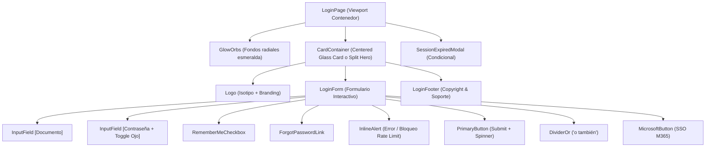

# Desglose de Componentes de la Página: Login (`PAGE-LOGIN-COMPONENTS`)
## Ecosistema Greenyard / Jolifoods — Spec-Driven Development (SDD)

Este documento detalla la **composición exacta de componentes de interfaz** que conforman la página de **Login**, especificando cómo se organizan jerárquicamente, sus props, su CSS y cómo se ensamblan en la vista final.

---

## 1. Árbol de Composición de la Página `Login`



---

## 2. Especificación Detallada de Componentes de la Página

### 2.1. Componente: `LoginPageContainer` (Contenedor Viewport)
- **Rol en la Página**: Provee el lienzo a pantalla completa (`100vh`), centrado flexbox y fondo oscuro slate con halos de luz desenfocados.
- **Estructura JSX**:
```tsx
<main className="gy-login-viewport">
  <div className="gy-orb gy-orb-top" aria-hidden="true" />
  <div className="gy-orb gy-orb-bottom" aria-hidden="true" />
  <div className="gy-login-card-slot">
    {children}
  </div>
</main>
```
- **CSS Canónico**:
```css
.gy-login-viewport {
  position: relative;
  min-height: 100vh;
  width: 100%;
  display: flex;
  align-items: center;
  justify-content: center;
  background-color: #0b0f19;
  padding: 1.5rem;
  overflow: hidden;
}

.gy-orb {
  position: absolute;
  border-radius: 50%;
  filter: blur(100px);
  pointer-events: none;
  opacity: 0.35;
}

.gy-orb-top {
  width: 450px;
  height: 450px;
  background: radial-gradient(circle, #10b981 0%, transparent 70%);
  top: -15%;
  right: -10%;
}

.gy-orb-bottom {
  width: 400px;
  height: 400px;
  background: radial-gradient(circle, #065f46 0%, transparent 70%);
  bottom: -15%;
  left: -10%;
}
```

---

### 2.2. Componente: `CardContainer` (Tarjeta Glassmorphic)
- **Rol en la Página**: Tarjeta translúcida con efecto frosted glass (`backdrop-filter: blur(20px)`), borde sutil con acento esmeralda superior y sombra profunda para destacar sobre el fondo.
- **Estructura JSX**:
```tsx
<section className="gy-login-card" aria-labelledby="login-heading">
  <div className="gy-login-card-content">
    {children}
  </div>
</section>
```
- **CSS Canónico**:
```css
.gy-login-card {
  width: 100%;
  max-width: 440px;
  background: rgba(15, 23, 42, 0.75);
  backdrop-filter: blur(20px);
  -webkit-backdrop-filter: blur(20px);
  border: 1px solid rgba(255, 255, 255, 0.08);
  border-top: 1px solid rgba(16, 185, 129, 0.35);
  border-radius: 1.5rem;
  box-shadow: 0 25px 50px -12px rgba(0, 0, 0, 0.75),
              0 0 20px -5px rgba(16, 185, 129, 0.15);
}

.gy-login-card-content {
  padding: 2.5rem 2rem;
  display: flex;
  flex-direction: column;
}

@media (max-width: 480px) {
  .gy-login-card-content {
    padding: 2rem 1.25rem;
  }
}
```

---

### 2.3. Componente: `LoginHeader` / `Logo`
- **Rol en la Página**: Encabezado visual institucional con el isotipo de Greenyard, título de la aplicación y subtítulo de bienvenida.
- **Estructura JSX**:
```tsx
<header className="gy-login-header">
  <div className="gy-login-logo-box">
    <svg className="w-10 h-10" viewBox="0 0 48 48" fill="none">
      <rect width="48" height="48" rx="14" fill="rgba(16,185,129,0.15)" stroke="#10b981" strokeWidth="1.5" />
      <path d="M24 10C16 10 12 16 12 24C12 32 18 38 24 38C30 38 36 32 36 24C36 14 28 10 24 10Z" fill="#10b981" />
      <path d="M24 18V30M18 24H30" stroke="#ffffff" strokeWidth="2.5" strokeLinecap="round" />
    </svg>
  </div>
  <h1 id="login-heading" className="gy-login-title">Greenyard</h1>
  <p className="gy-login-subtitle">Ingresa tus datos para acceder a la plataforma</p>
</header>
```
- **CSS Canónico**:
```css
.gy-login-header {
  display: flex;
  flex-direction: column;
  align-items: center;
  text-align: center;
  margin-bottom: 2rem;
}

.gy-login-logo-box {
  width: 60px;
  height: 60px;
  display: flex;
  align-items: center;
  justify-content: center;
  background: rgba(16, 185, 129, 0.1);
  border: 1px solid rgba(16, 185, 129, 0.25);
  border-radius: 1.25rem;
  margin-bottom: 1rem;
  box-shadow: 0 0 25px rgba(16, 185, 129, 0.25);
}

.gy-login-title {
  font-size: 1.625rem;
  font-weight: 800;
  color: #f8fafc;
  letter-spacing: -0.025em;
  margin: 0;
}

.gy-login-subtitle {
  font-size: 0.8125rem;
  color: #94a3b8;
  margin-top: 0.35rem;
  margin-bottom: 0;
}
```

---

### 2.4. Componente: `InputField` (Documento & Contraseña)
- **Rol en la Página**: Captura validada con retroalimentación inmediata, íconos de prefijo SVG y botón interactivo para revelar u ocultar la contraseña.
- **Estructura JSX (Contraseña)**:
```tsx
<div className="gy-input-group">
  <label htmlFor="login-password" className="gy-label">Contraseña</label>
  <div className="gy-input-wrapper">
    <span className="gy-icon-prefix">
      <LockIcon className="w-5 h-5 text-slate-400" />
    </span>
    <input
      id="login-password"
      type={showPassword ? "text" : "password"}
      placeholder="••••••••••••"
      className="gy-field gy-field-has-suffix"
      {...register('password')}
    />
    <button
      type="button"
      onClick={() => setShowPassword(!showPassword)}
      className="gy-icon-suffix-btn"
      aria-label={showPassword ? "Ocultar contraseña" : "Ver contraseña"}
    >
      {showPassword ? <EyeOffIcon className="w-5 h-5" /> : <EyeIcon className="w-5 h-5" />}
    </button>
  </div>
  {errors.password && <span className="gy-error-text">{errors.password.message}</span>}
</div>
```

---

### 2.5. Componente: `RememberAndForgotBar` (Recuérdame y Olvido)
- **Rol en la Página**: Casilla de verificación para persistir el documento en el navegador y enlace de recuperación de credenciales.
- **Estructura JSX**:
```tsx
<div className="gy-form-options-bar">
  <label className="gy-checkbox-label">
    <input
      type="checkbox"
      className="gy-checkbox-native"
      {...register('rememberMe')}
    />
    <span className="gy-checkbox-custom" />
    <span className="gy-checkbox-text">Recordarme</span>
  </label>

  <a href="/recuperar-clave" className="gy-forgot-link">
    ¿Olvidaste tu contraseña?
  </a>
</div>
```
- **CSS Canónico**:
```css
.gy-form-options-bar {
  display: flex;
  align-items: center;
  justify-content: space-between;
  margin: 0.25rem 0 1.5rem 0;
  font-size: 0.75rem;
}

.gy-checkbox-label {
  display: flex;
  align-items: center;
  gap: 0.5rem;
  color: #94a3b8;
  cursor: pointer;
  user-select: none;
}

.gy-checkbox-native {
  accent-color: #10b981;
  width: 1rem;
  height: 1rem;
  border-radius: 0.25rem;
}

.gy-forgot-link {
  color: #34d399;
  text-decoration: none;
  font-weight: 500;
  transition: color 0.2s ease;
}

.gy-forgot-link:hover {
  color: #6ee7b7;
  text-decoration: underline;
}
```

---

### 2.6. Componente: `PrimaryButton` (Botón Submit)
- **Rol en la Página**: Envío de credenciales con transición a estado de carga (spinner de red) y halo esmeralda.
- **Estructura JSX**:
```tsx
<button
  type="submit"
  disabled={isLoading}
  className="gy-btn-submit"
>
  {isLoading ? (
    <>
      <span className="gy-spinner" />
      <span>Iniciando sesión...</span>
    </>
  ) : (
    <>
      <ShieldCheckIcon className="w-5 h-5" />
      <span>Ingresar al Sistema</span>
    </>
  )}
</button>
```

---

### 2.7. Componente: `Divider` ("o también")
- **Rol en la Página**: Separador visual elegante con líneas sutiles para delimitar el acceso local del acceso institucional SSO.
- **Estructura JSX & CSS**:
```tsx
<div className="gy-divider">
  <span className="gy-divider-line" />
  <span className="gy-divider-text">o continúa con</span>
  <span className="gy-divider-line" />
</div>
```
```css
.gy-divider {
  display: flex;
  align-items: center;
  margin: 1.5rem 0;
  gap: 1rem;
}

.gy-divider-line {
  flex: 1;
  height: 1px;
  background-color: rgba(255, 255, 255, 0.08);
}

.gy-divider-text {
  font-size: 0.6875rem;
  text-transform: uppercase;
  letter-spacing: 0.08em;
  color: #64748b;
}
```

---

### 2.8. Componente: `MicrosoftButton` (SSO Corporativo)
- **Rol en la Página**: Acceso federado con Microsoft 365 Entra ID para personal administrativo y líderes.
- **Estructura JSX**:
```tsx
<button
  type="button"
  onClick={onMicrosoftLogin}
  disabled={isLoading}
  className="gy-btn-microsoft"
>
  <svg className="w-5 h-5" viewBox="0 0 21 21">
    <path fill="#f25022" d="M1 1h9v9H1z" />
    <path fill="#00a4ef" d="M1 11h9v9H1z" />
    <path fill="#7fba00" d="M11 1h9v9h-9z" />
    <path fill="#ffb900" d="M11 11h9v9h-9z" />
  </svg>
  <span>Iniciar sesión con Microsoft 365</span>
</button>
```

---

## 3. Ensamblaje Completo de la Página (`LoginPage.tsx`)

A continuación se presenta el código canónico de integración de todos los componentes en una sola vista funcional:

```tsx
import React, { useState } from 'react';
import { useForm } from 'react-hook-form';
import { zodResolver } from '@hookform/resolvers/zod';
import { IdCard, Lock, Eye, EyeOff, ShieldCheck, AlertCircle } from 'lucide-react';
import { loginSchema, LoginFormData } from './schemas/auth.schema';
import { showToast, CorporateToaster } from './components/ToastNotification';
import './LoginPage.css';

export const LoginPage: React.FC = () => {
  const [showPassword, setShowPassword] = useState(false);
  const [isLoading, setIsLoading] = useState(false);
  const [errorMessage, setErrorMessage] = useState<string | null>(null);

  const {
    register,
    handleSubmit,
    formState: { errors },
  } = useForm<LoginFormData>({
    resolver: zodResolver(loginSchema),
    defaultValues: {
      documento: localStorage.getItem('gy_remembered_doc') || '',
      rememberMe: Boolean(localStorage.getItem('gy_remembered_doc')),
    },
  });

  const onSubmit = async (data: LoginFormData) => {
    setIsLoading(true);
    setErrorMessage(null);

    try {
      const response = await fetch('/api/auth/login/', {
        method: 'POST',
        headers: { 'Content-Type': 'application/json' },
        credentials: 'include', // Para cookies HttpOnly
        body: JSON.stringify(data),
      });

      const resData = await response.json();

      if (!response.ok) {
        const errorMsg = resData.message || 'Error en autenticación';
        setErrorMessage(errorMsg);
        if (response.status === 429) {
          showToast.warning('Acceso temporalmente bloqueado', {
            description: 'Demasiados intentos fallidos. Espera 60 segundos antes de reintentar.',
          });
        } else {
          showToast.error('Fallo de autenticación', {
            description: errorMsg,
          });
        }
        return;
      }

      if (data.rememberMe) {
        localStorage.setItem('gy_remembered_doc', data.documento);
      } else {
        localStorage.removeItem('gy_remembered_doc');
      }

      showToast.success('¡Inicio de sesión exitoso!', {
        description: `Bienvenido, ${resData.user?.nombre || 'Colaborador'}.`,
      });

      setTimeout(() => {
        window.location.href = '/dashboard';
      }, 800);
    } catch (err: any) {
      const connError = err.message || 'No fue posible conectar con el servidor de autenticación.';
      setErrorMessage(connError);
      showToast.error('Error de conectividad', {
        description: connError,
      });
    } finally {
      setIsLoading(false);
    }
  };

  const handleMicrosoftLogin = () => {
    window.location.href = '/api/auth/microsoft/login/';
  };

  return (
    <main className="gy-login-viewport">
      {/* Contenedor de Toasts Sonner */}
      <CorporateToaster />

      <div className="gy-orb gy-orb-top" aria-hidden="true" />
      <div className="gy-orb gy-orb-bottom" aria-hidden="true" />

      <section className="gy-login-card" aria-labelledby="login-title">
        <div className="gy-login-card-content">
          {/* Logo & Header */}
          <header className="gy-login-header">
            <div className="gy-login-logo-box">
              <svg className="w-10 h-10" viewBox="0 0 48 48" fill="none">
                <rect width="48" height="48" rx="14" fill="rgba(16,185,129,0.15)" stroke="#10b981" strokeWidth="1.5" />
                <path d="M24 10C16 10 12 16 12 24C12 32 18 38 24 38C30 38 36 32 36 24C36 14 28 10 24 10Z" fill="#10b981" />
                <path d="M24 18V30M18 24H30" stroke="#ffffff" strokeWidth="2.5" strokeLinecap="round" />
              </svg>
            </div>
            <h1 id="login-title" className="gy-login-title">Greenyard</h1>
            <p className="gy-login-subtitle">Ingresa tus datos para acceder a la plataforma</p>
          </header>

          {/* Formulario */}
          <form onSubmit={handleSubmit(onSubmit)} className="gy-login-form" noValidate>
            {/* Campo Documento */}
            <div className="gy-input-group">
              <label htmlFor="login-document" className="gy-label">Número de Documento</label>
              <div className="gy-input-wrapper">
                <IdCard className="gy-icon-prefix w-5 h-5" />
                <input
                  id="login-document"
                  type="text"
                  inputMode="numeric"
                  placeholder="Ej. 1037645123"
                  className={`gy-field ${errors.documento ? 'has-error' : ''}`}
                  {...register('documento')}
                />
              </div>
              {errors.documento && <span className="gy-error-text">{errors.documento.message}</span>}
            </div>

            {/* Campo Contraseña */}
            <div className="gy-input-group">
              <label htmlFor="login-password" className="gy-label">Contraseña</label>
              <div className="gy-input-wrapper">
                <Lock className="gy-icon-prefix w-5 h-5" />
                <input
                  id="login-password"
                  type={showPassword ? 'text' : 'password'}
                  placeholder="••••••••••••"
                  className={`gy-field gy-field-has-suffix ${errors.password ? 'has-error' : ''}`}
                  {...register('password')}
                />
                <button
                  type="button"
                  onClick={() => setShowPassword(!showPassword)}
                  className="gy-icon-suffix-btn"
                  aria-label={showPassword ? 'Ocultar contraseña' : 'Ver contraseña'}
                >
                  {showPassword ? <EyeOff className="w-5 h-5" /> : <Eye className="w-5 h-5" />}
                </button>
              </div>
              {errors.password && <span className="gy-error-text">{errors.password.message}</span>}
            </div>

            {/* Opciones: Recordar & Olvido */}
            <div className="gy-form-options-bar">
              <label className="gy-checkbox-label">
                <input type="checkbox" className="gy-checkbox-native" {...register('rememberMe')} />
                <span>Recordarme</span>
              </label>
              <a href="/recuperar-clave" className="gy-forgot-link">¿Olvidaste tu contraseña?</a>
            </div>

            {/* Alerta de Error en línea si la API falla */}
            {errorMessage && (
              <div className="gy-alert-error" role="alert">
                <AlertCircle className="w-4 h-4 flex-shrink-0" />
                <span>{errorMessage}</span>
              </div>
            )}

            {/* Botón Submit */}
            <button type="submit" disabled={isLoading} className="gy-btn-submit">
              {isLoading ? (
                <>
                  <span className="gy-spinner" />
                  <span>Autenticando...</span>
                </>
              ) : (
                <>
                  <ShieldCheck className="w-5 h-5" />
                  <span>Ingresar al Sistema</span>
                </>
              )}
            </button>
          </form>

          {/* Separador */}
          <div className="gy-divider">
            <span className="gy-divider-line" />
            <span className="gy-divider-text">o continúa con</span>
            <span className="gy-divider-line" />
          </div>

          {/* Botón Microsoft */}
          <button type="button" onClick={handleMicrosoftLogin} disabled={isLoading} className="gy-btn-microsoft">
            <svg className="w-5 h-5" viewBox="0 0 21 21">
              <path fill="#f25022" d="M1 1h9v9H1z" />
              <path fill="#00a4ef" d="M1 11h9v9H1z" />
              <path fill="#7fba00" d="M11 1h9v9h-9z" />
              <path fill="#ffb900" d="M11 11h9v9h-9z" />
            </svg>
            <span>Iniciar sesión con Microsoft 365</span>
          </button>

          {/* Footer */}
          <footer className="gy-login-footer">
            <p>Greenyard Jolifoods • Acceso Seguro Corporativo</p>
          </footer>
        </div>
      </section>
    </main>
  );
};
```
