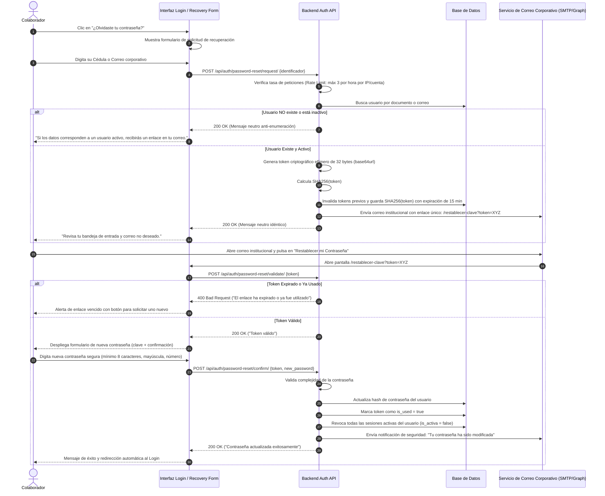

# 09. Flujo Completo de Restablecimiento de Contraseña
## Módulo de Login / Autenticación — SDD Jolifoods (`GY-SPEC-AUTH-RESET`)

Este documento especifica de extremo a extremo la arquitectura, contratos de API, pantallas y reglas de seguridad para el **Restablecimiento y Recuperación de Contraseña** cuando un usuario ha olvidado sus credenciales.

---

## 1. Diagrama de Secuencia del Flujo de Restablecimiento



---

## 2. Contratos de API del Flujo de Restablecimiento

### 2.1. Solicitud de Enlace (`POST /api/auth/password-reset/request/`)

#### Request Body
```json
{
  "identificador": "1037645123"
}
```
*(El identificador puede ser el número de cédula o el correo electrónico corporativo).*

#### Response 200 OK (Protección Anti-Enumeración)
> **REGLA DE SEGURIDAD**: La respuesta debe ser exactamente igual independientemente de si el usuario existe o no, para impedir que atacantes deduzcan qué personas están registradas.

```json
{
  "success": true,
  "message": "Si los datos ingresados corresponden a una cuenta activa en Jolifoods, recibirás un enlace en tu correo corporativo en los próximos minutos."
}
```

---

### 2.2. Validación de Token (`POST /api/auth/password-reset/validate/`)

Verifica que el enlace no haya expirado antes de mostrar los campos de entrada de la nueva contraseña.

#### Request Body
```json
{
  "token": "a8f3b2c1d4e5f6..."
}
```

#### Response 200 OK
```json
{
  "valid": true,
  "email_enmascarado": "j***a@jolifoods.com"
}
```

#### Response 400 Bad Request (Expirado o Consumido)
```json
{
  "valid": false,
  "error_code": "TOKEN_EXPIRED_OR_INVALID",
  "message": "El enlace de recuperación es inválido o ha caducado. Por favor genera una nueva solicitud."
}
```

---

### 2.3. Confirmación de Nueva Contraseña (`POST /api/auth/password-reset/confirm/`)

#### Request Body
```json
{
  "token": "a8f3b2c1d4e5f6...",
  "new_password": "NuevaPasswordSegura!2026",
  "confirm_password": "NuevaPasswordSegura!2026"
}
```

#### Response 200 OK
```json
{
  "success": true,
  "message": "Tu contraseña ha sido actualizada satisfactoriamente. Por favor inicia sesión con tu nueva credencial."
}
```

---

## 3. Políticas de Seguridad Mandatorias

1. **Tiempo de Vida del Token**: Máximo **15 minutos**.
2. **One-Time Token**: Un token consumido jamás puede volver a ser utilizado.
3. **Cierre de Sesiones Previas**: El cambio de contraseña invalida de forma inmediata todos los Access Tokens y Refresh Tokens emitidos previamente para ese usuario, impidiendo que un atacante que hubiera robado una sesión antigua continúe conectado.
4. **Notificación de Confirmación**: Se debe despachar de inmediato un correo informando que la contraseña fue cambiada, con la IP y dispositivo donde ocurrió el cambio.
