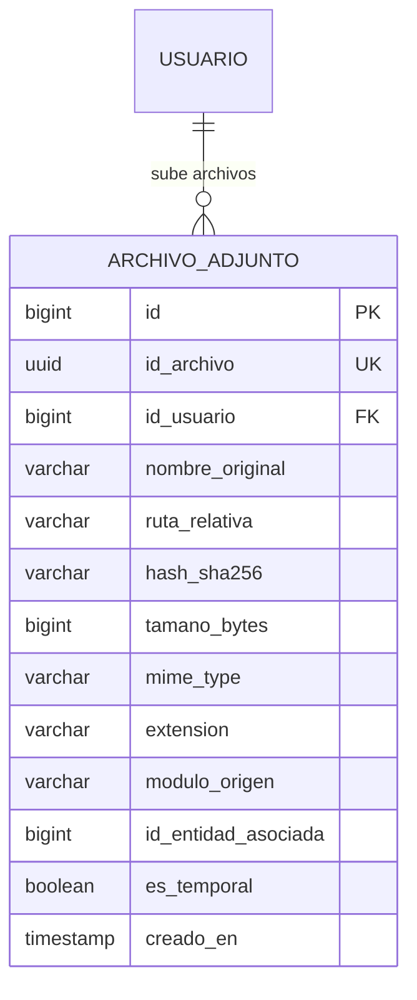

# Especificación de Modelos de Datos — Archivos Adjuntos y Media
## Ecosistema Jolifoods — Spec-Driven Development (SDD)
### Módulo: `archivos` (Buenas Prácticas BP-07, BP-08 y FileUploaderPro)

Este documento define la especificación formal de persistencia para el almacenamiento seguro de archivos adjuntos (documentos PDF, evidencias fotográficas, firmas digitales y soportes contables) en la carpeta canónica `backend/media/` con resolución relativa y deduplicación criptográfica.

---

## 1. Esquema Relacional de Datos



---

## 2. Definición DDL SQL Estándar (PostgreSQL)

```sql
CREATE TABLE IF NOT EXISTS media_archivo_adjunto (
    id BIGSERIAL PRIMARY KEY,
    id_archivo UUID NOT NULL DEFAULT gen_random_uuid() UNIQUE,
    id_usuario BIGINT REFERENCES auth_usuario(id) ON DELETE SET NULL,
    nombre_original VARCHAR(255) NOT NULL,
    ruta_relativa VARCHAR(500) NOT NULL,
    hash_sha256 CHAR(64) NOT NULL,
    tamano_bytes BIGINT NOT NULL,
    mime_type VARCHAR(100) NOT NULL,
    extension VARCHAR(20) NOT NULL,
    modulo_origen VARCHAR(80) NOT NULL,
    id_entidad_asociada BIGINT NULL,
    es_temporal BOOLEAN DEFAULT FALSE,
    creado_en TIMESTAMP WITH TIME ZONE DEFAULT CURRENT_TIMESTAMP NOT NULL
);

-- Índices para búsqueda rápida y deduplicación instantánea
CREATE INDEX idx_archivo_hash_sha256 ON media_archivo_adjunto (hash_sha256);
CREATE INDEX idx_archivo_modulo_entidad ON media_archivo_adjunto (modulo_origen, id_entidad_asociada);
CREATE INDEX idx_archivo_usuario ON media_archivo_adjunto (id_usuario, creado_en DESC);
```

---

## 3. Implementación de Referencia en Django ORM

```python
import uuid
import hashlib
from pathlib import Path
from django.db import models
from django.conf import settings

def custom_upload_to(instance, filename):
    """
    Genera una ruta 100% relativa dentro de backend/media/
    Estructura: media/cargas/<modulo>/<YYYY>/<MM>/<uuid>.<ext>
    """
    ext = Path(filename).suffix.lower()
    return f"cargas/{instance.modulo_origen}/{instance.creado_en.strftime('%Y/%m')}/{instance.id_archivo}{ext}"

class ArchivoAdjunto(models.Model):
    """
    Registro canónico de archivos persistidos en disco.
    Cumple la regla BP-07 (Rutas Relativas) y BP-08 (Directorio Canónico backend/media/).
    """
    id_archivo = models.UUIDField(default=uuid.uuid4, unique=True, editable=False)
    usuario = models.ForeignKey(
        settings.AUTH_USER_MODEL,
        on_delete=models.SET_NULL,
        null=True,
        blank=True,
        related_name="archivos_subidos"
    )
    nombre_original = models.CharField(max_length=255)
    archivo = models.FileField(upload_to=custom_upload_to, max_length=500)
    hash_sha256 = models.CharField(
        max_length=64,
        db_index=True,
        help_text="Hash SHA-256 para evitar duplicidad física de archivos en disco"
    )
    tamano_bytes = models.PositiveBigIntegerField()
    mime_type = models.CharField(max_length=100)
    extension = models.CharField(max_length=20)
    modulo_origen = models.CharField(max_length=80, db_index=True)
    id_entidad_asociada = models.BigIntegerField(null=True, blank=True)
    es_temporal = models.BooleanField(default=False)
    creado_en = models.DateTimeField(auto_now_add=True, db_index=True)

    class Meta:
        db_table = "media_archivo_adjunto"
        verbose_name = "Archivo Adjunto"
        verbose_name_plural = "Archivos Adjuntos"
        ordering = ["-creado_en"]
        indexes = [
            models.Index(fields=["modulo_origen", "id_entidad_asociada"]),
        ]

    def __str__(self):
        return f"{self.nombre_original} ({self.tamano_bytes / 1024:.1f} KB) - {self.modulo_origen}"

    @property
    def url_relativa(self):
        """Retorna la URL relativa para el frontend sin dominios absolutos."""
        return f"{settings.MEDIA_URL}{self.archivo.name}"
