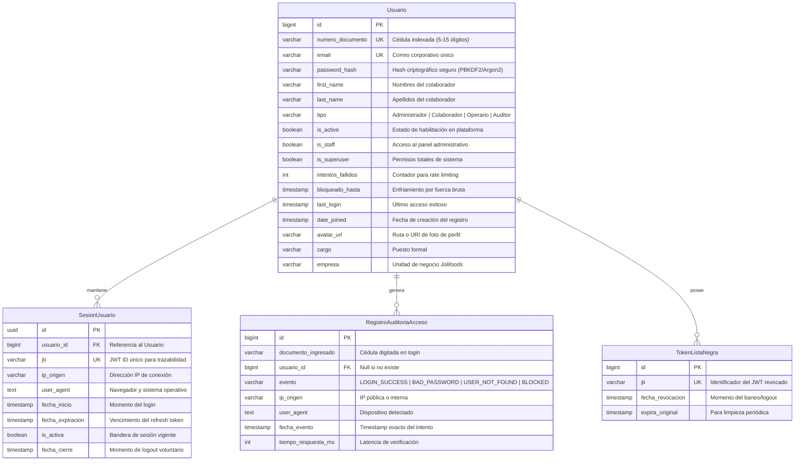

# Especificación de Modelos de Datos para Login — SDD
## Directorio: `.sdd/model/login/`

Este directorio define la **especificación formal de datos (Data Models)** para el módulo de inicio de sesión y gestión de identidad corporativa en el ecosistema **Jolifoods / Greenyard**.

Garantiza que cualquier base de datos (PostgreSQL, SQLite, MySQL) o cualquier ORM (Django ORM, SQLAlchemy, Prisma, TypeORM) implemente exactamente los mismos campos, tipos de datos, restricciones de integridad, índices y mecanismos de auditoría.

---

## 1. Índice de Especificaciones de Modelos

| Archivo | Modelo / Entidad | Propósito y Contenido |
| :--- | :--- | :--- |
| **[`spec_model_usuario.md`](./spec_model_usuario.md)** | **`Usuario` (User Entity)** | Modelo principal de identidad: documento (cédula), email, hash de clave, roles, estado activo y control de fuerza bruta. |
| **[`spec_model_sesion_auditoria.md`](./spec_model_sesion_auditoria.md)** | **`SesionUsuario` & `AuditoriaAcceso`** | Registro inmutable de cada intento de acceso, IP, agente de usuario, token JTI y trazabilidad de sesiones activas. |
| **[`spec_model_restablecimiento.md`](./spec_model_restablecimiento.md)** | **`TokenRestablecimientoClave`** | Tokens criptográficos efímeros (15 min) de un solo uso para recuperación segura de contraseñas. |
| **[`esquema_sql_canonico.md`](./esquema_sql_canonico.md)** | **DDL SQL Universal** | Sentencias `CREATE TABLE`, `CREATE INDEX` y restricciones relacionales agnósticas de motor. |
| **[`implementacion_django_orm.md`](./implementacion_django_orm.md)** | **Código de Referencia ORM** | Implementación completa lista para usar en Django (`AbstractBaseUser`, `BaseUserManager`, `PermissionsMixin`). |

---

## 2. Diagrama Entidad-Relación (ERD)

