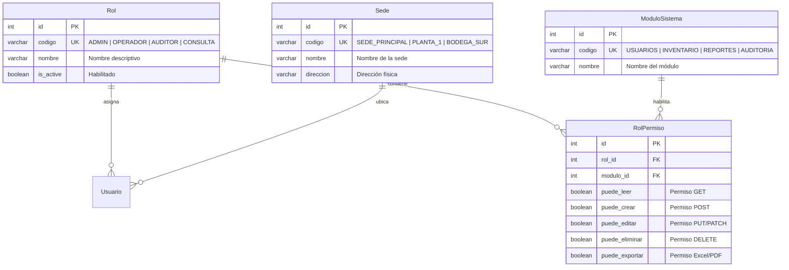

# Especificación de Modelo: Roles, Sedes y Control de Acceso (RBAC)
## Directorio: `.sdd/model/roles/spec_model_roles_permisos.md`

Este documento formaliza el modelo de **Control de Acceso Basado en Roles (RBAC)** y sedes operativas en el ecosistema **Jolifoods**.

---

## 1. Catálogo Canónico de Roles Institucionales

| Rol | Código | Descripción | Nivel de Privilegio |
| :--- | :--- | :--- | :--- |
| **Administrador** | `ADMIN` | Acceso irrestricto al sistema, usuarios, configuración y auditoría. | Nivel 1 (Total) |
| **Operador de Módulo** | `OPERADOR` | Registro y edición de operaciones del negocio (pesajes, despachos, ventas). | Nivel 2 (Operativo) |
| **Auditor de Calidad** | `AUDITOR` | Revisión de bitácoras, trazabilidad y reportes de conformidad. Solo lectura y exportación. | Nivel 3 (Fiscalización) |
| **Consulta General** | `CONSULTA` | Visualización básica sin capacidad de modificación de datos. | Nivel 4 (Lectura) |

---

## 2. Entidades Relacionales



---

## 3. Implementación en Django ORM

```python
from django.db import models

class Rol(models.Model):
    codigo = models.CharField(max_length=30, unique=True, db_index=True)
    nombre = models.CharField(max_length=100)
    descripcion = models.TextField(blank=True)
    is_active = models.BooleanField(default=True)

    class Meta:
        db_table = "auth_rol"
        verbose_name = "Rol Corporativo"

    def __str__(self):
        return f"{self.nombre} ({self.codigo})"


class Sede(models.Model):
    codigo = models.CharField(max_length=30, unique=True, db_index=True)
    nombre = models.CharField(max_length=150)
    direccion = models.CharField(max_length=255, blank=True)
    is_active = models.BooleanField(default=True)

    class Meta:
        db_table = "organizacion_sede"
        verbose_name = "Sede Jolifoods"

    def __str__(self):
        return self.nombre


class RolPermiso(models.Model):
    rol = models.ForeignKey(Rol, on_delete=models.CASCADE, related_name="permisos")
    modulo = models.CharField(max_length=50, db_index=True)
    puede_leer = models.BooleanField(default=True)
    puede_crear = models.BooleanField(default=False)
    puede_editar = models.BooleanField(default=False)
    puede_eliminar = models.BooleanField(default=False)
    puede_exportar = models.BooleanField(default=False)

    class Meta:
        db_table = "auth_rol_permiso"
        unique_together = ("rol", "modulo")

    def __str__(self):
        return f"Permisos {self.rol.codigo} en {self.modulo}"
```
