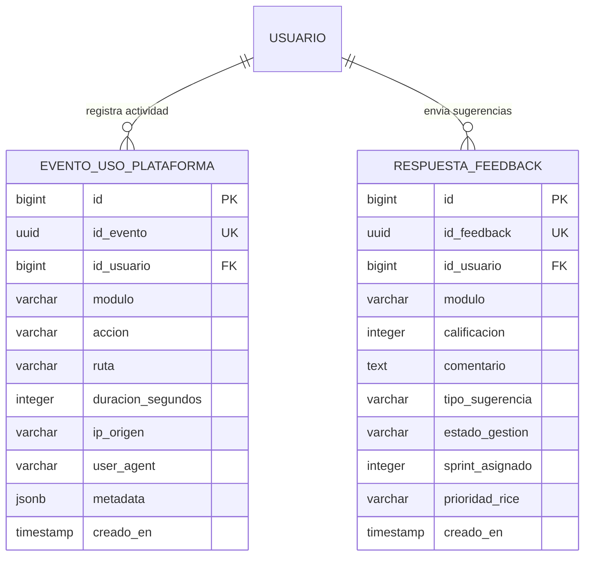

# Especificación de Modelos de Datos — Telemetría y Feedback In-App
## Ecosistema Jolifoods — Spec-Driven Development (SDD)
### Módulo: `telemetria` (Protocolo SDLC 12 y PlatformUsageDashboard)

Este documento define la especificación formal de persistencia para el rastreo de adopción, analítica de uso de módulos y recepción de micro-encuestas / retroalimentación in-app de usuarios, respaldando la toma de decisiones del equipo técnico y senior para la mejora continua.

---

## 1. Esquema Relacional de Datos



---

## 2. Definición DDL SQL Estándar (PostgreSQL)

```sql
-- 1. Tabla de Eventos de Uso y Telemetría
CREATE TABLE IF NOT EXISTS telemetria_evento_uso (
    id BIGSERIAL PRIMARY KEY,
    id_evento UUID NOT NULL DEFAULT gen_random_uuid() UNIQUE,
    id_usuario BIGINT REFERENCES auth_usuario(id) ON DELETE SET NULL,
    modulo VARCHAR(80) NOT NULL,
    accion VARCHAR(60) NOT NULL DEFAULT 'NAVIGATE',
    ruta VARCHAR(255) NOT NULL,
    duracion_segundos INTEGER DEFAULT 0,
    ip_origen VARCHAR(45),
    user_agent TEXT,
    metadata JSONB DEFAULT '{}'::jsonb,
    creado_en TIMESTAMP WITH TIME ZONE DEFAULT CURRENT_TIMESTAMP NOT NULL
);

-- Índices para analítica de alto rendimiento
CREATE INDEX idx_telemetria_modulo_creado ON telemetria_evento_uso (modulo, creado_en DESC);
CREATE INDEX idx_telemetria_usuario_creado ON telemetria_evento_uso (id_usuario, creado_en DESC);
CREATE INDEX idx_telemetria_creado_en ON telemetria_evento_uso (creado_en DESC);

-- 2. Tabla de Micro-Encuestas y Feedback de Usuarios
CREATE TABLE IF NOT EXISTS telemetria_feedback_usuario (
    id BIGSERIAL PRIMARY KEY,
    id_feedback UUID NOT NULL DEFAULT gen_random_uuid() UNIQUE,
    id_usuario BIGINT REFERENCES auth_usuario(id) ON DELETE SET NULL,
    modulo VARCHAR(80) NOT NULL,
    calificacion SMALLINT NOT NULL CHECK (calificacion BETWEEN 1 AND 5),
    comentario TEXT,
    tipo_sugerencia VARCHAR(40) DEFAULT 'MEJORA' CHECK (tipo_sugerencia IN ('MEJORA', 'BUG', 'NUEVA_FUNCION', 'USABILIDAD')),
    estado_gestion VARCHAR(30) DEFAULT 'PENDIENTE' CHECK (estado_gestion IN ('PENDIENTE', 'EVALUADO', 'EN_SPRINT', 'RESUELTO', 'DESCARTADO')),
    sprint_asignado INTEGER NULL,
    prioridad_rice NUMERIC(5,2) NULL,
    creado_en TIMESTAMP WITH TIME ZONE DEFAULT CURRENT_TIMESTAMP NOT NULL
);

CREATE INDEX idx_feedback_modulo_estado ON telemetria_feedback_usuario (modulo, estado_gestion);
CREATE INDEX idx_feedback_creado ON telemetria_feedback_usuario (creado_en DESC);
```

---

## 3. Implementación de Referencia en Django ORM

```python
import uuid
from django.db import models
from django.conf import settings

class EventoUsoPlataforma(models.Model):
    """Registra eventos discretos de navegación, clicks en KPIs o exportaciones."""
    id_evento = models.UUIDField(default=uuid.uuid4, unique=True, editable=False)
    usuario = models.ForeignKey(
        settings.AUTH_USER_MODEL,
        on_delete=models.SET_NULL,
        null=True,
        blank=True,
        related_name="eventos_telemetria"
    )
    modulo = models.CharField(max_length=80, db_index=True)
    accion = models.CharField(max_length=60, default="NAVIGATE")
    ruta = models.CharField(max_length=255)
    duracion_segundos = models.PositiveIntegerField(default=0)
    ip_origen = models.GenericIPAddressField(null=True, blank=True)
    user_agent = models.TextField(blank=True, default="")
    metadata = models.JSONField(default=dict, blank=True)
    creado_en = models.DateTimeField(auto_now_add=True, db_index=True)

    class Meta:
        db_table = "telemetria_evento_uso"
        verbose_name = "Evento de Telemetría"
        verbose_name_plural = "Eventos de Telemetría"
        ordering = ["-creado_en"]
        indexes = [
            models.Index(fields=["modulo", "-creado_en"]),
        ]

    def __str__(self):
        return f"{self.modulo} - {self.accion} ({self.creado_en.strftime('%Y-%m-%d %H:%M')})"


class RespuestaFeedback(models.Model):
    """Almacena micro-encuestas in-app y solicitudes de mejora por parte de usuarios."""
    class TipoSugerencia(models.TextChoices):
        MEJORA = "MEJORA", "Mejora de Proceso"
        BUG = "BUG", "Reporte de Error"
        NUEVA_FUNCION = "NUEVA_FUNCION", "Nueva Característica"
        USABILIDAD = "USABILIDAD", "Usabilidad / Ergonomía"

    class EstadoGestion(models.TextChoices):
        PENDIENTE = "PENDIENTE", "Pendiente de Revisión"
        EVALUADO = "EVALUADO", "Evaluado por Senior"
        EN_SPRINT = "EN_SPRINT", "En Desarrollo de Sprint"
        RESUELTO = "RESUELTO", "Implementado en Producción"
        DESCARTADO = "DESCARTADO", "Descartado"

    id_feedback = models.UUIDField(default=uuid.uuid4, unique=True, editable=False)
    usuario = models.ForeignKey(
        settings.AUTH_USER_MODEL,
        on_delete=models.SET_NULL,
        null=True,
        blank=True,
        related_name="feedbacks_enviados"
    )
    modulo = models.CharField(max_length=80, db_index=True)
    calificacion = models.PositiveSmallIntegerField(
        help_text="Puntuación de satisfacción del usuario (1 a 5)"
    )
    comentario = models.TextField(blank=True, default="")
    tipo_sugerencia = models.CharField(
        max_length=40,
        choices=TipoSugerencia.choices,
        default=TipoSugerencia.MEJORA
    )
    estado_gestion = models.CharField(
        max_length=30,
        choices=EstadoGestion.choices,
        default=EstadoGestion.PENDIENTE,
        db_index=True
    )
    sprint_asignado = models.PositiveIntegerField(null=True, blank=True)
    prioridad_rice = models.DecimalField(
        max_digits=5, decimal_places=2, null=True, blank=True,
        help_text="Puntaje calculado según modelo RICE"
    )
    creado_en = models.DateTimeField(auto_now_add=True, db_index=True)

    class Meta:
        db_table = "telemetria_feedback_usuario"
        verbose_name = "Feedback de Usuario"
        verbose_name_plural = "Feedbacks de Usuarios"
        ordering = ["-creado_en"]

    def __str__(self):
        return f"[{self.calificacion}★] {self.modulo}: {self.tipo_sugerencia} ({self.estado_gestion})"
